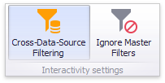
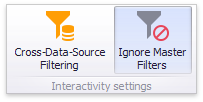

# Interactivity
This document describes the features that enable interaction between the **Range Filter** and other dashboard items. These features include **Master Filtering**.

## Master Filtering
The Dashboard allows you to use any data-aware dashboard item as a filter for other dashboard items (**Master Filter**). To learn more, see the [Master Filtering](../../interactivity/master-filtering.md) topic, which describes filtering concepts common to all dashboard items.

Master filtering is always enabled for the Range Filter dashboard item. This Range Filter displays a chart with selection thumbs that allow you to filter out values displayed along the argument axis.

To enable filtering across data sources for the Range Filter, use the **Cross-Data-Source Filtering** button in the **Data** Ribbon tab.

You can enable/disable ignoring of other master filter items using the **Ignore Master Filters** button in the **Data** Ribbon tab.

