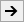
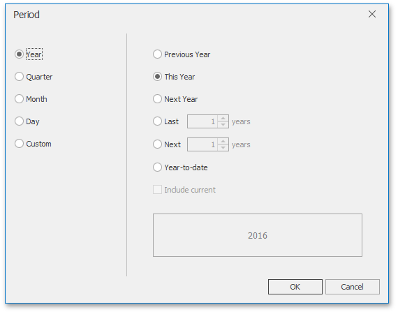

The Range Filter dashboard item allows you to add a number of predefined date-time periods that can be used to perform a selection (for instance, _year-to-date_ or _quarter-to-date_).

To add a period, click the _[Options](../../../../../dashboard-for-desktop/articles/dashboard-designer/ui-elements/data-items-pane.md)_ button (the  icon) next to the [Argument](../../../../../dashboard-for-desktop/articles/dashboard-designer/designing-dashboard-items/range-filter/providing-data.md) placeholder or use the **Edit Periods** button in the ribbon's **Design** tab. This invokes the **Edit Periods** dialog.

To add the selected period, use the  button or double-click this period.

This period will be added to the right pane of the Edit Periods dialog. The following settings are available for the added period.
* **Caption** - Specifies the caption corresponding to the period.
* **Period** - Displays the date-time interval corresponding to the period.
* **Default** - Allows you to use the selected period as the default selection in the Range Filter dashboard item.

If necessary, you can customize the selected period by clicking the **Edit** button in the Edit Periods dialog. This invokes the **Period** dialog.

> Note that the **Edit** dialog above contains the displayed periods (**Year**, **Quarter**, **Month**, **Day**) if the [group interval](../../../../../dashboard-for-desktop/articles/dashboard-designer/data-shaping/grouping.md) of the Range Filter argument is set to **Day-Month-Year**.

This dialog allows you to add the following periods.
* **Year** - A period duration is measured in years.
	* **Previous Year** - Identifies the entire previous year.
	* **This Year** - Identifies the entire current year.
	* **Next Year** - Identifies the entire next year.
	* **Last Years** - Identifies a specific number of previous years. Use the **Include current** option to specify whether or not the period is ended with the current year.
	* **Next Years** - Identifies a specific number of next years. Use the **Include current** option to specify whether or not the period is started from the current year.
	* **Year-to-date** - A period from the beginning of the current year and up to the current day.
* **Quarter** - Period duration is measured in quarters.
	* **Previous Quarter** - Identifies the entire previous quarter.
	* **This Quarter** - Identifies the entire current quarter.
	* **Next Quarter** - Identifies the entire next quarter.
	* **Last Quarter** - Identifies a specific number of previous quarters. Use the **Include current** option to specify whether or not the period ends with the current quarter.
	* **Next Quarter** - Identifies a specific number of following quarters. Use the **Include current** option to specify whether or not the period starts from the current quarter.
	* **Quarter-to-date** - A period from the beginning of the current quarter and up to the current day.
* **Month** - Period duration is measured in months.
	* **Previous Month** - Identifies the entire previous month.
	* **This Month** - Identifies the entire current month.
	* **Next Month** - Identifies the entire next month.
	* **Last Month** - Identifies a specific number of previous months. Use the **Include current** option to specify whether or not the period ends with the current month.
	* **Next Month** - Identifies a specific number of the following months. Use the **Include current** option to specify whether or not the period starts with the current month.
	* **Month-to-date** - A period from the beginning of the current month and up to the current day.
* **Day** - Period duration is measured in days.
	* **Previous Day** - Identifies the entire previous day.
	* **This Day** - Identifies the entire current day.
	* **Next Day** - Identifies the entire next day.
	* **Last Day** - Identifies a specific number of previous days. Use the **Include current** option to specify whether or not the period ends with the current day.
	* **Next Day** - Identifies a specific number of the following days. Use the **Include current** option to specify whether or not the period starts with the current day.
* **Custom** - A custom period.
	* Allows you to specify a period with the custom boundaries (**Start point** and **End point**).
		
		
		
		You can specify the following settings for the start/end boundaries.
		* **None** - The selection will begin from the start/end of the visible range.
		* **Fixed** - Allows you to select a specific date value using the calendar.
		* **Flow** - Allows you to select a relative date value. The **Interval** option specifies the interval between the current date and the required date. The **Offset** option allows you to set the number of such intervals.
			
			> Note that the **Offset** option can accept negative and positive values. Negative values correspond to dates before the current date, while positive values correspond to future dates.