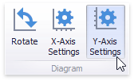
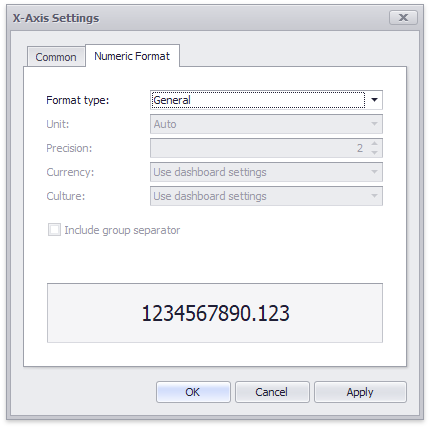

# Axes
Scatter Chart X and Y-axes are numerical axis of values. You can specify various axes settings to change visual data presentation.

To access X and Y-axis settings, use the **X-Axis Settings/Y-Axis Settings** buttons in the **Diagram** section of the **Design** Ribbon tab.

This will invoke the **X-Axis Settings/Y-Axis Settings** dialog.

In this dialog, you can specify the following settings.
* **Always show zero level** - Specifies whether or not the axis' zero level is visible. If this option is unchecked, the visible axis range is defined based on the values plotted in the chart.
	
	> [!NOTE]
	> Note that the **X-Axis Settings** dialog does not contain this option.
* **Reverse** - Allows you to reverse the axis. If the axis is reversed, its values are ordered from top to down.
* **Show grid lines** - Allows you to hide and show grid lines for the axis.
* **Show axis** - Allows you to hide and show the axis.
* **Show title** - Allows you to hide and show the axis title. You can choose whether to use the default text or specify a custom string.
* **Logarithmic scale** - Specifies whether or not the axis should display its numerical values using a logarithmic scale. The combo box next to this option allows you to select the logarithmic base from one of the predefined values.

The **Numeric Format** tab allows you to specify the numeric display formats for axis data, as described in the [Formatting Data](../../data-shaping/formatting-data.md) document.

The tab contains the following settings.

* **Format type** - Specifies format types for numeric values. 
* **Unit** - Specifies the unit to convert the numeric values.
* **Precision** - Specifies the number of fractional digits to display.
* **Currency** - Specifies the currency symbol and format provided by the current culture settings.
* **Culture** - Specifies the name of a culture that defines the currency symbol and format.
* **Include group separator** - Specifies whether separators should be inserted between digit groups.