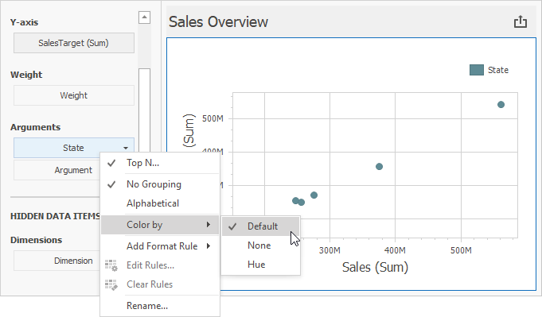

# Coloring

The Scatter Chart dashboard item does not paint its arguments in **Default** mode.

The image below displays the Scatter Chart dashboard item whose _State_ points use **Default** mode:

>[!Tip]
>**Documentation:** 
>* [Conditional Formatting](conditional-formatting.md)
>* [Coloring Basics](../../appearance-customization/coloring.md)