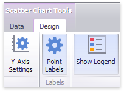

# Labels
The Scatter Chart display can display **point labels** that contain descriptions for data points, and provide **tooltips** with additional information.

## Point Labels
To manage the visibility of point labels, click the **Point Labels** button in the **Design** ribbon tab.

In the invoked **Point Label Settings** dialog, enable the **Show point labels** check box to show point labels.

You can specify the following settings for point labels:
* **Content** - Specifies the type of content displayed within point labels. You can select one of the following options.
	* _Values_ - Point labels show summary values from X and Y-axes.
	* _Argument_ - Point labels show argument values.
	* _Argument and values_ - Point labels show argument values and corresponding summary values.
	* _Weight_ - Point labels show the weight summary value.
	* _Argument and weight_ - Point labels show the argument value and the corresponding weight summary value.
* **Overlapping mode** - Specifies the label overlap mode. The following options are available.
	* _Hide overlapping labels_ - If two or more labels overlap, some of them are automatically hidden to avoid overlapping.
	* _None_ - The overlapping resolving algorithm is disabled.
	* _Reposition overlapping labels_ - The default algorithm to re-position point labels in a random way, and avoid overlapping labels.
* **Orientation** - Specifies the orientation of point labels. The following options are available.
	* _Default_ -  A point label is displayed in its default orientation.
	* _Rotate to the Right_ - A point label is rotated 90 degrees clockwise.
	* _Rotate to the Left_ - A point label is rotated 90 degrees counter clockwise.