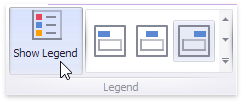
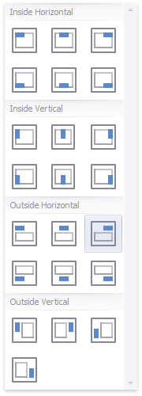

# Legend
A **legend** is an element of a scatter chart that identifies chart points (for instance, [colored points](../../appearance-customization/coloring/coloring-concepts.md) corresponding to argument values).

This topic describes how to customize various legend settings.

## Visibility
You can specify whether or not a chart should display a legend.

In the Designer, use the **Show Legend** button in the **Legend** section of the **Design** Ribbon tab.

## Position and Orientation
To specify the legend's position and orientation, select one of the predefined options from the gallery in the **Design** Ribbon tab.

