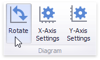

# Orientation
You can rotate the Scatter Chart so that the [X-axis](axes.md) becomes vertical, and the [Y-axis](axes.md) becomes horizontal.

To rotate a Chart in the Designer, use the **Rotate** button in the **Diagram** section of the **Design** Ribbon tab.

