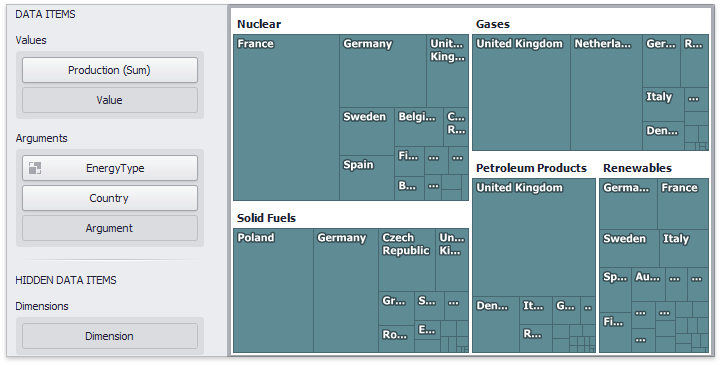

# Coloring
Certain dashboard items provide the capability to color dashboard item elements by associating dimension values/measures and specified colors. You can choose whether to use a global color scheme to provide consistent colors for identical values or specify a local color scheme for each dashboard item. To learn more about coloring concepts common for all dashboard items, see the [Coloring](../../appearance-customization/coloring.md) section.

By default, the Treemap dashboard item colors its tiles in the following way.
* If the Treemap dashboard item contains only measures (the **Values** section), values corresponding to different measures are colored by hue.
* If the Treemap dashboard item contains arguments (the **Arguments** section), values corresponding to the first argument are colored by hue.

If necessary, you can change the default behavior. For instance, the image below shows the Treemap dashboard item whose measures and argument values are painted with the same color.

