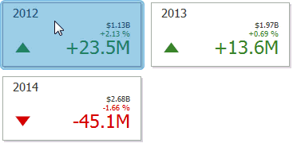

# Drill-Down
Dashboard provides the **Drill-Down** feature, which allows you to change the detail level of data displayed in a dashboard item. The Drill-Down feature enables users to drill down to display detail data, or drill up to view more general information.

* [Enable Drill-Down](#enable-drill-down)
* [Perform Drill-Down](#perform-drill-down)

## <a name="enable-drill-down"/>Enable Drill-Down
Drill-down requires that the [data section](../bind-dashboard-items-to-data/bind-dashboard-items-to-data.md) contains several dimensions...

... or a hierarchy data item (in [OLAP mode](../bind-dashboard-items-to-data/bind-dashboard-items-to-data-in-olap-mode.md)).

To enable drill-down, click the **Drill-Down** button in the **Data** Ribbon tab (or the  button if you are using the toolbar menu).

> [!NOTE]
> If the selected dashboard item contains several types of elements that can be used for drill-down, the Ribbon or Toolbar will provide the appropriate buttons to switch between these types (e.g., **Arguments** and **Series** buttons in a Chart). For details, refer to the documentation for the individual dashboard items in the [Dashboard Item Settings](../dashboard-item-settings.md) topic.

The following dashboard items support the Drill-Down feature.
* [Chart](../dashboard-item-settings/chart.md)
* [Scatter Chart](../dashboard-item-settings/scatter-chart.md)
* [Grid](../dashboard-item-settings/grid.md)
* [Pies](../dashboard-item-settings/pies.md)
* [Cards](../dashboard-item-settings/cards.md)
* [Gauges](../dashboard-item-settings/gauges.md)
* [Treemap](../dashboard-item-settings/treemap.md)

## <a name="perform-drill-down"/>Perform Drill-Down
To learn how you can drill down using a particular [dashboard item](../dashboard-item-settings.md), refer to the **Drill-Down** topic in the **Interactivity** section for this item.