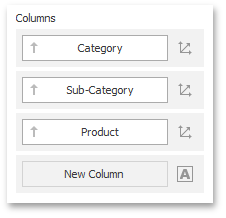

Dashboard provides the **Drill-Down** feature, which allows you to change the detail level of data displayed in a dashboard item. The Drill-Down feature enables users to drill down to display detail data, or drill up to view more general information.

* [Enable Drill-Down](#enable-drill-down)
* [Perform Drill-Down](#perform-drill-down)

## <a name="enable-drill-down"/>Enable Drill-Down
Drill-down requires that the [data section](../../../../dashboard-for-desktop/articles/dashboard-designer/binding-dashboard-items-to-data/binding-dashboard-items-to-data.md) contains several dimensions...

 

... or a hierarchy data item (in [OLAP mode](../../../../dashboard-for-desktop/articles/dashboard-designer/binding-dashboard-items-to-data/binding-dashboard-items-to-data-in-olap-mode.md)).

To enable drill-down, click the **Drill-Down** button in the **Data** Ribbon tab (or the  button if you are using the toolbar menu).

> If the selected dashboard item contains several types of elements that can be used for drill-down, the Ribbon or Toolbar will provide the appropriate buttons to switch between these types (e.g., **Arguments** and **Series** buttons in a Chart). For details, refer to the documentation for the individual dashboard items in the [Designing Dashboard Items](../../../../dashboard-for-desktop/articles/dashboard-designer/designing-dashboard-items.md) topic.

The following dashboard items support the Drill-Down feature.
* [Chart](../../../../dashboard-for-desktop/articles/dashboard-designer/designing-dashboard-items/chart.md)
* [Scatter Chart](../../../../dashboard-for-desktop/articles/dashboard-designer/designing-dashboard-items/scatter-chart.md)
* [Grid](../../../../dashboard-for-desktop/articles/dashboard-designer/designing-dashboard-items/grid.md)
* [Pies](../../../../dashboard-for-desktop/articles/dashboard-designer/designing-dashboard-items/pies.md)
* [Cards](../../../../dashboard-for-desktop/articles/dashboard-designer/designing-dashboard-items/cards.md)
* [Gauges](../../../../dashboard-for-desktop/articles/dashboard-designer/designing-dashboard-items/gauges.md)
* [Treemap](../../../../dashboard-for-desktop/articles/dashboard-designer/designing-dashboard-items/treemap.md)

## <a name="perform-drill-down"/>Perform Drill-Down
To learn how you can drill down using a particular [dashboard item](../../../../dashboard-for-desktop/articles/dashboard-designer/designing-dashboard-items.md), refer to the **Drill-Down** topic in the **Interactivity** section for this item.