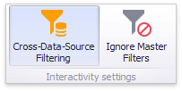

# Master Filtering
The **Dashboard** allows you to use any data aware dashboard item as a filter for other dashboard items (**Master Filter**). You can select elements in a **Master Filter** item (grid records, chart bars, pie segments, etc.) to filter data in other dashboard items by the selected values.

* [Master Filtering Overview](#master-filtering-overview)
* [Master Filter Settings](#master-filter-settings)
* [Apply Filtering](#apply-filtering)

## Master Filtering Overview
Dashboard items can be divided into four groups by their master filtering capabilities.
1. **Data visualization dashboard items** allow you to enable master filtering by specifying the selection mode. The following dashboard items allow you to manage their master filtering mode.
	* [Chart](../dashboard-item-settings/chart.md)
	* [Scatter Chart](../dashboard-item-settings/scatter-chart.md)
	* [Grid](../dashboard-item-settings/grid.md)
	* [Pies](../dashboard-item-settings/pies.md)
	* [Cards](../dashboard-item-settings/cards.md)
	* [Gauges](../dashboard-item-settings/gauges.md)
	* [Choropleth Map](../dashboard-item-settings/choropleth-map.md)
	* [Geo Point Maps](../dashboard-item-settings/geo-point-maps.md)
	* [Treemap](../dashboard-item-settings/treemap.md)
	
	To learn how to manage master filtering for these items, see [Master Filter Settings](#master-filter-settings).
2. **Filter elements** represent a special type of dashboard item whose main purpose is to apply filtering to other dashboard items. This capability is always enabled for these dashboard items.
	
	The following filter elements are available.
	* Combo Box
	* List Box
	* Tree View
	
	Instead of switching between standard master filtering modes, some filter elements allow you to switch their type. This allows you to select a single value or multiple values.
	
	To learn more, see the [Filter Elements](../dashboard-item-settings/filter-elements.md) section.
3. **Range Filter** is a special type of dashboard item that displays a chart with selection thumbs and allows you to filter out values displayed along the argument axis.
	
	To learn more, see the [Range Filter](../dashboard-item-settings/range-filter.md) section.
4. **Dashboard item group** allows you to manage interaction between dashboard items in and out of the group.
	
	To learn more about the interactivity capabilities of the dashboard item group, see the **Interactivity** paragraph in the [Dashboard Item Group](../dashboard-item-settings/dashboard-item-group.md) topic.

## Master Filter Settings
### Master Filtering Modes

The Master Filter item supports two selection modes.
* _Multiple_ - Allows you to select multiple elements in the Master Filter item.
* _Single_ - Allows you to select only one element in the Master Filter item. When this mode is enabled, the default selection will be set to a Master Filter element. You can change this selection, but cannot clear it.

To enable/disable master filtering, use the **Multiple Master Filter** or **Single Master Filter** buttons in the **Data** Ribbon tab.

> [!NOTE]
> If the selected dashboard item contains several types of elements that can be used for filtering, the Ribbon or Toolbar will provide the appropriate buttons to switch between these types (e.g., the **Arguments** and **Series** buttons in the Chart). For details, refer to the documentation for individual dashboard items in the [Dashboard Item Settings](../dashboard-item-settings.md) section.

### Filtering Across Data Sources

When different items in a dashboard are bound to different data sources, you can specify that a particular Master Filter should be applied across data sources. This means that it will apply filtering to fields with matching names in all data sources.

Fields are matched by their full names. For fields in other data sources to be affected by Master Filtering, their names must match the name of the field in the current data source, and they must belong to the same hierarchy level so that their full names also match. For instance, _Customer.City_ and _Customer.Address.City_ will not be treated as matching fields.

To enable filtering across data sources, use the **Cross-Data-Source Filtering** button in the **Data** Ribbon tab.

### Preventing Items from Being Filtered

You can prevent specific dashboard items from being affected by Master Filters. To do this, use the **Ignore Master Filters** button in the **Data** Ribbon tab.

## <a name="apply-filtering"/>Apply Filtering
To learn how to apply filtering in a specific [dashboard item](../dashboard-item-settings.md), refer to the **Master Filtering** topic in the **Interactivity** section for this item.