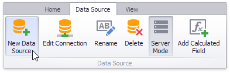
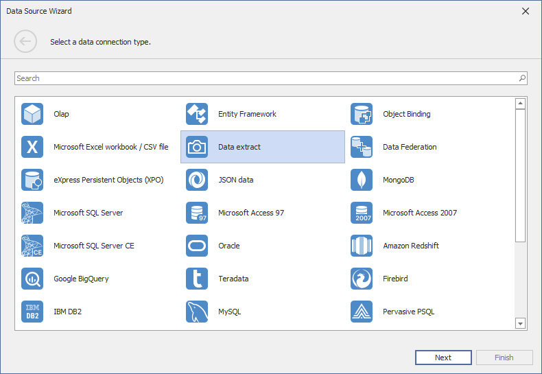

# Binding to Extract Data Sources
The Dashboard Designer allows you to create a _data extract_ that is a compressed snapshot of data obtained from the existing data source. This data is saved to a local file and can be updated from the original data source at any time.

> [!NOTE]
> Note that data extracts cannot be created for the [OLAP data sources](connecting-to-olap-cubes.md).

To create a new data extract from the existing data source, perform the following steps.
1. Click the **New Data Source** button in the **Data Source** ribbon tab.
	
	
2. On the first page of the invoked **Data Source Wizard** dialog, select **Data extract** and click **Next**.
	
	
3. On the next page, select whether to create a new data extract or establish a connection to an existing one.
	
	
	* To create a new data extract, select **Create a new data extract from the existing data source** and specify the required **Data Source** and **Data Member**. Click **Next**.
	* To establish a connection to an existing data extract, select **Load an existing data extract from a file** and locate the required _*.dat_ file. Click **Finish**.
4. **(Conditional)** The next page only appears if you are creating the data extract based on the Entity Framework or Object data sources, and allows you to select the required fields.
	
	
5. On the next page, you can specify the filter used to extract data. To learn how to specify the filter criteria, see [Filter Data via the Filter Editor](../../../../interface-elements-for-desktop/articles/filter-editor/filter-data-via-the-filter-editor.md).
	
	
	
	You can also limit the number of extracted rows by enabling the **Limit rows to extract** option and specifying the required number of rows. Click **Next**.
	
	> [!NOTE]
	> Use the **Preview** button to see the data that will be placed into the resulting data extract.
6. **(Conditional)** The next page only appears if the original data source contains [parameters](../data-analysis/using-dashboard-parameters.md) (for instance, the [SQL query is filtered](../work-with-data/filter-queries.md) using a dashboard parameter).
	
	
7. On the final page, specify a path to the file that will contain the resulting data extract.
	
	
	
	Click **Finish**. This creates the data extract and displays its fields in the [Data Source Browser](../ui-elements/data-source-browser.md). You can use this data extract as a regular data source.