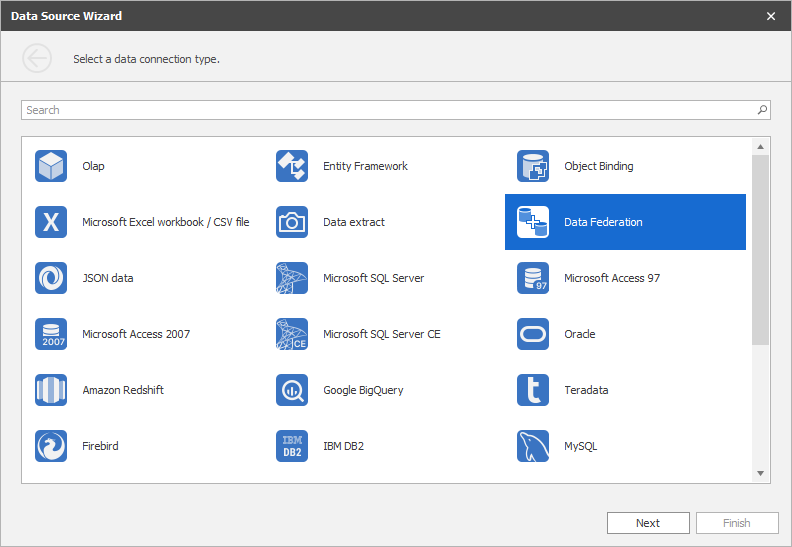
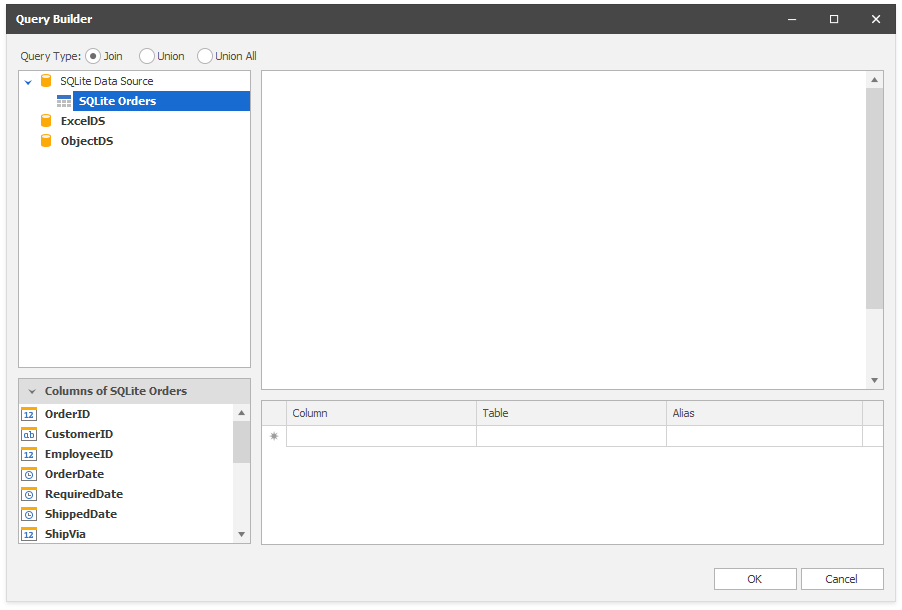
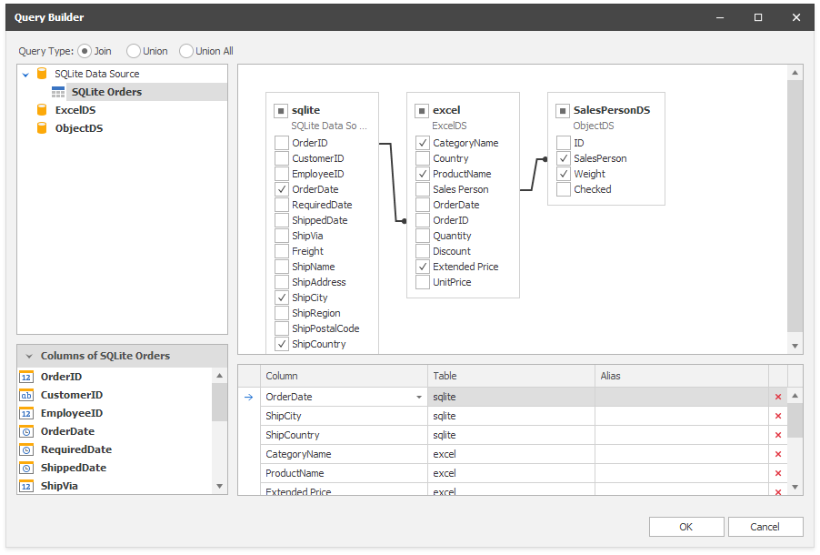
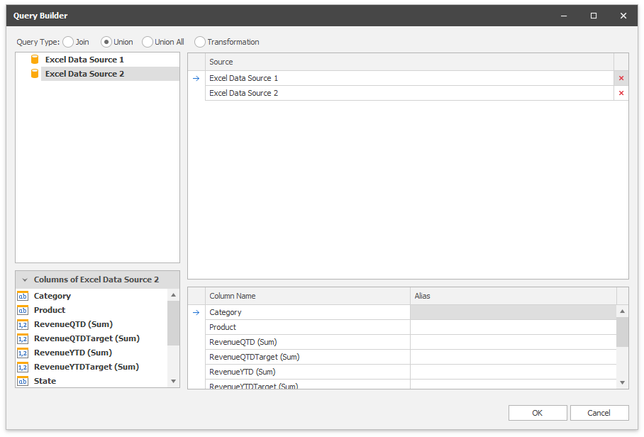
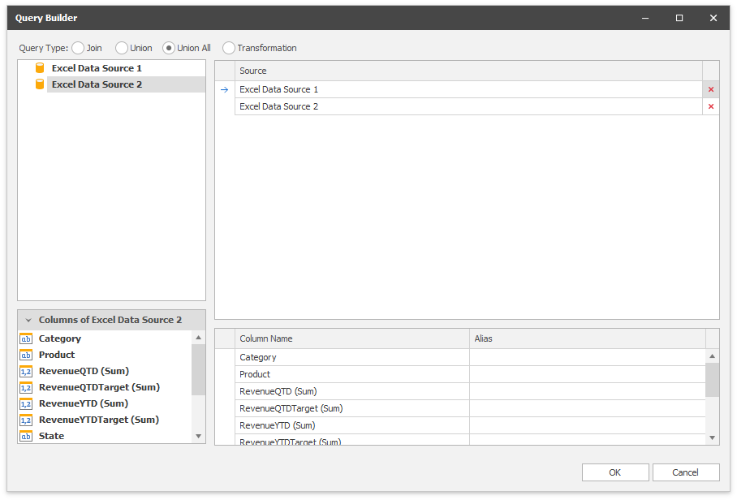
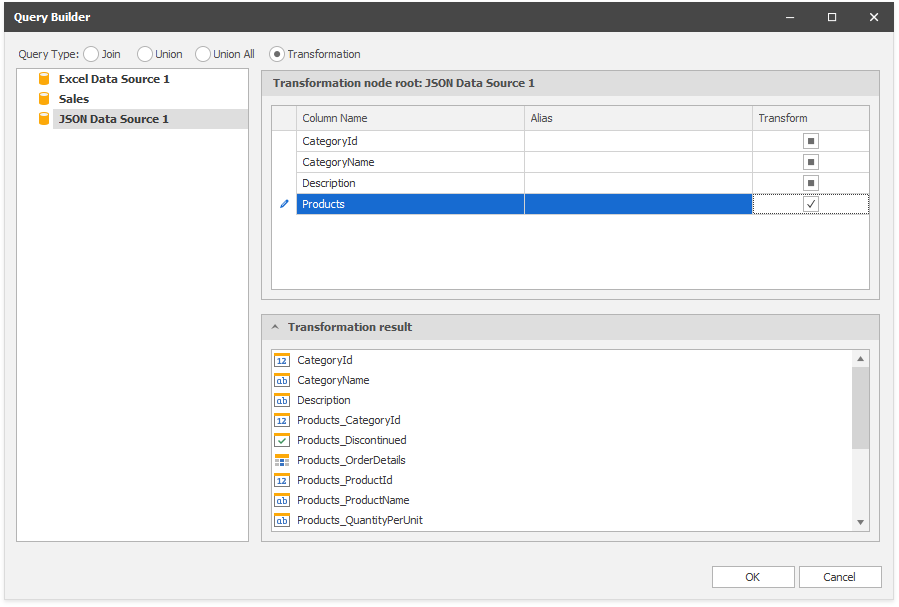
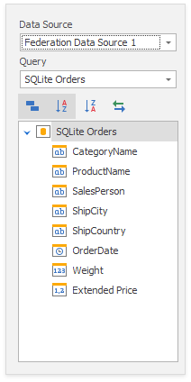

# Binding to Federated Data Source

A _federated data source_ combines multiple data sources (except OLAP) in one.

## Overview

You can create a federated data source if a dashboard contains at least one data source. To do this, create a query where you specify how to federate existing data sources. The federated query can be one of the following types:

### Join
Combines rows from two or more tables based on a column they share. The join type specifies records that have matching values in both tables.

### Union
Combines rows from two or more tables into one data set and removes duplicate rows in merged tables. You can only create a union query for data sources that contain columns with the same name. Data types of such columns should be [implicitly converted](https://docs.microsoft.com/en-us/dotnet/csharp/programming-guide/types/casting-and-type-conversions#implicit-conversions).

### Union All
Operates like **Union**, but duplicates rows from different tables when they contain the same data.

### Transformation
Unfolds complex objects and flattens them in a simple data set. The dashboard does not support data source fields that store collections, so you need to transform the data source into a new flattened data table.

## Create a Federated Data Source with the Data Source Wizard

To create a federated data source with the Data Source Wizard, perform the following steps:

1. Click the **New Data Source** button in the **Data Source** ribbon tab.

   

2. On the first page of the invoked **Data Source Wizard** dialog, select **Data Federation** and click **Next**.

   

3. The [Query Builder](../../dashboard-designer/work-with-data/using-the-query-builder.md) dialog displays available data sources.

   

4. Select the **Query Type**:

   **Join**

   Drag-and-drop the data sources, specify the related column to create the relationship between tables, and select the columns you want to include in the query. Use _* (All Columns)_ to get a complete list of the columns from a table. Columns included in the query are displayed in the bottom pane where you can configure their settings.

   

   **Union**

   Double-click the data sources you want to combine. Unlike join queries, you cannot select individual columns. Columns included in the query are displayed in the bottom pane where you can specify their aliases.

   

   **Union All** 

   Double-click the data sources you want to combine. A **UnionAll** query duplicates rows from different tables even if they contain the same data. Columns included in the query are displayed in the bottom pane where you can specify their aliases.

   

   **Transformation**

   Select a data source/query that contains columns you want to transform. Select the **Transform** checkbox next to the column you want to unfold and flatten. The bottom pane allows you to specify the aliases for the generated columns.

   

   Click **OK** to create a query.
 
5. The [Data Source Browser](../ui-elements/data-source-browser.md) displays the newly created Federated Data Source.

   The image below displays a new _Federation Data Source 1_ with a joined _SQlite Orders_ query.

   

    The query name is the same as the root table's name in the query builder. Click the **Rename** button in the **Query** group on the **Data Source** ribbon tab to change the query name.
