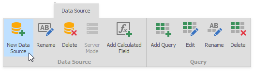
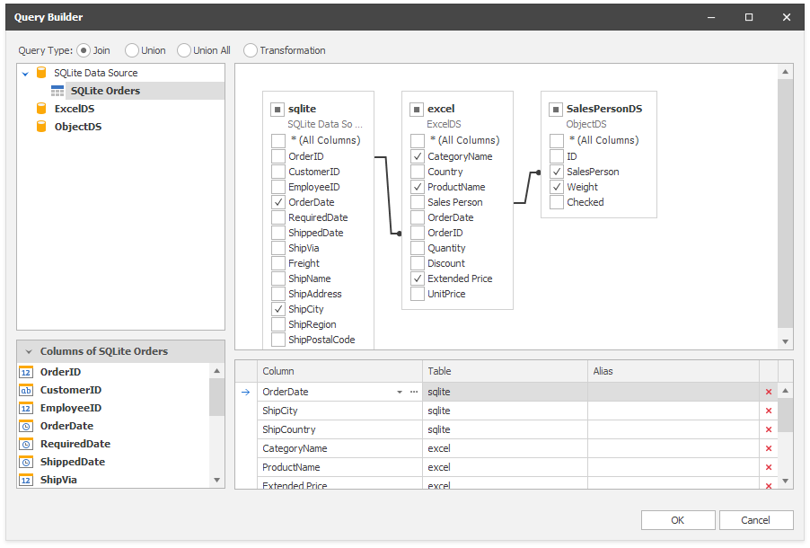
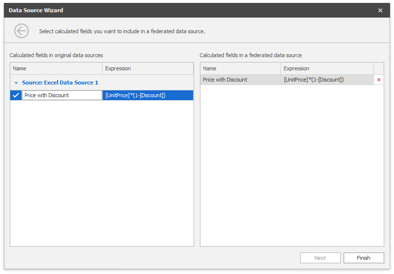

# Binding to Federated Data Source

You can create a federated data source if a dashboard contains at least one data source. Create a federated query where you specify how to federate existing data sources.

You can create federated queries of the following types:

- **Join**

  Combines rows from two or more tables based on a clause. 

- **Union and Union All**

  The **Union** query combines rows from two or more tables into one data set and removes duplicate rows in merged tables. The **UnionAll** query does the same, except it doesn't remove duplicated rows. You can create a union query for data sources if data types of their columns are [implicitly converted](https://docs.microsoft.com/en-us/dotnet/csharp/programming-guide/types/casting-and-type-conversions#implicit-conversions). 
- **Transformation**

  If a data source contains a complex column (an object), you can transform its properties to display columns separately in a flattened view.
  
## Create a Federated Data Source with the Data Source Wizard

Follow the steps below to create a federated data source with the Data Source Wizard:
### Create a New Federated Data Source

Click the **New Data Source** button in the **Data Source** ribbon tab.

On the first page of the invoked **Data Source Wizard** dialog, select **Data Federation** and click **Next**.

### Select the Query Type 

The [Query Builder](../../dashboard-designer/work-with-data/using-the-query-builder.md) displays the available data sources you can use to create queries.

   

   **Join**
     
   Drag the data sources you want to join to the diagram pane, specify the related column to create the relationship between tables, and select the columns you want to include in the query. Use _* (All Columns)_ to get a complete list of columns from a table. Columns included in the query are displayed in the bottom pane where you can configure their settings.

   

   **Union**

   Double-click the data sources you want to combine. Unlike Join queries, you cannot select individual columns. Columns included in the query are displayed in the bottom pane where you can specify their aliases.

   

   **Union All** 

   Double-click the data sources you want to combine. A **UnionAll** query duplicates rows from different tables even if they contain the same data. Columns included in the query are displayed in the bottom pane where you can specify their aliases.

   

   **Transformation**

   Select a data source/query that contains columns you want to transform. Select the **Transform** checkbox next to the column you want to unfold and flatten. The bottom pane allows you to specify the aliases for the generated columns.

   

Click **OK** to create a query.

### Copy Calculated Fields
The Data Source Wizard invokes the following page if one of the selected data sources contains calculated fields. Drag or double-click the calculated field you want to copy to the resulting federated data source. You can specify the name of the copied calculated field in the left Grid. 

### See the Result

The [Data Source Browser](../ui-elements/data-source-browser.md) displays the newly created Federated Data Source. 

The image below displays a new _Federation Data Source 1_ with a joined _SQlite_ Orders query.

The query name is the same as the root table's name in the query builder. Click the **Rename** button in the **Query** group on the **Data Source** ribbon tab to change the query name.
