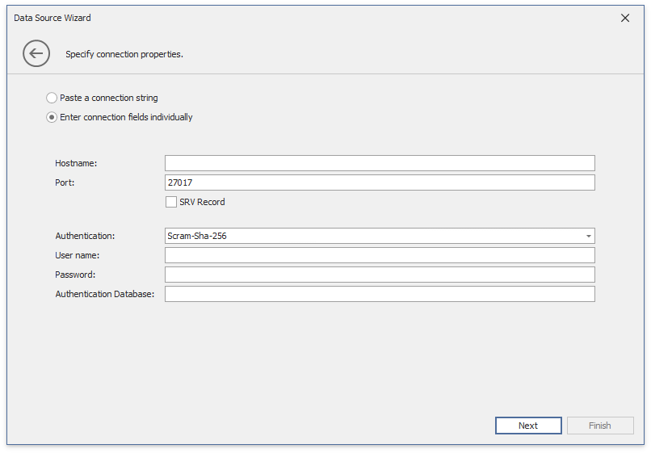

# Binding to MongoDB

The WinForms Designer allows you to connect to MongoDB in the Data Source Wizard. 

> [!NOTE]
> The [MongoDB.Driver](https://www.nuget.org/packages/MongoDB.Driver) package should be installed in your project to supply MongoDB data at runtime.

Follow the steps below to establish a database connection:

1. Click the **New Data Source** button in the **Data Source** ribbon tab.
	
    
2. On the first page of the invoked **Data Source Wizard** dialog, select **MongoDB** and click **Next**.

	
    
3. Specify connection parameters on the next page in the following ways: 

    - Pass an entire string. 

        

        Refer to the following topic for information about connection string format and options: [Connection String URI Format](https://docs.mongodb.com/manual/reference/connection-string/).

    - Enter connection fields individually.

        

   

4. The following page allows you to configure queries. Select databases and collections that you want to load from the MongoDB instance. A string stored in a query's **Collection** column is the default name for the query. The names of MongoDB queries should be unique. You can use the **Alias** column to set unique names for queries in the same collection. To filter queries, add a filter string to the **Filter** column.

     
