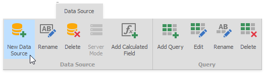
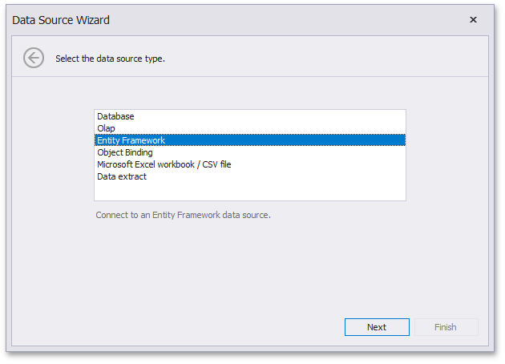
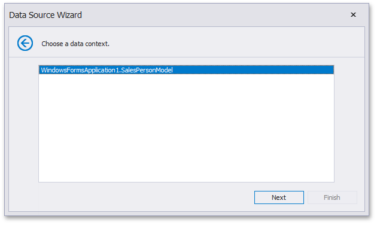
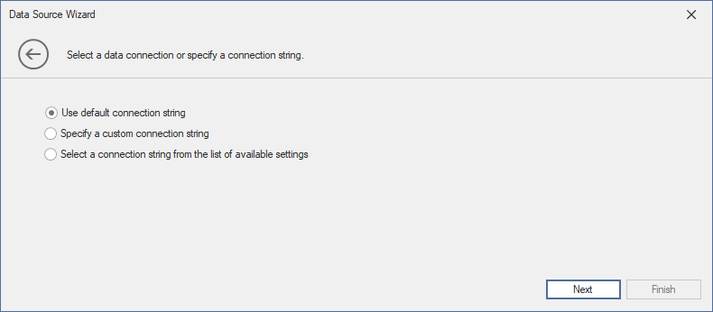
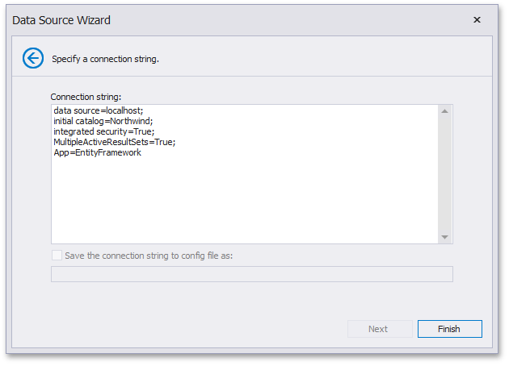

# Connect to EF Data Sources

To bind a dashboard to an Entity Framework data source from the current project, do the following.

1. Click the **New Data Source** button in the **Data Source** ribbon tab.

   

2. On the first page of the invoked **Data Source Wizard** dialog, select **Entity Framework** and click **Next**.

   

3. On the next page, select the available data context and click **Next**.

   

4. On the final page, choose the connection string corresponding to the selected data context and click **Finish**.

   

   If the application configuration file does not contain the required connection string, or you need to specify the connection string manually, select **No, specify a custom connection string** and click **Next**.

   

   On this page, specify a custom connection string and click **Finish**. This creates the data source and displays its fields in the [Data Source Browser](../ui-elements\data-source-browser.md).
