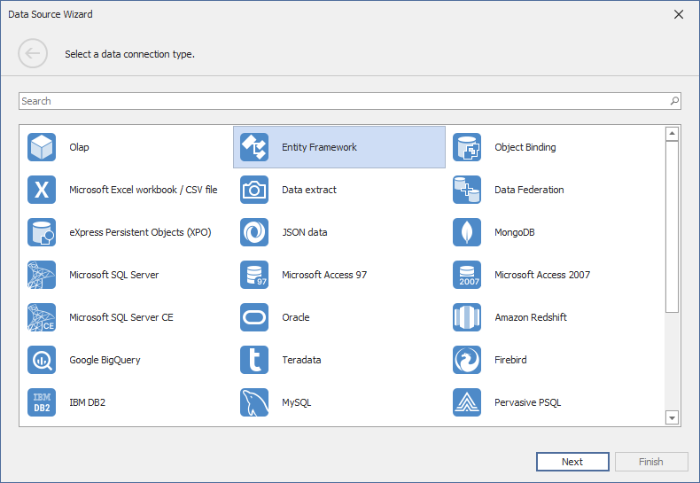
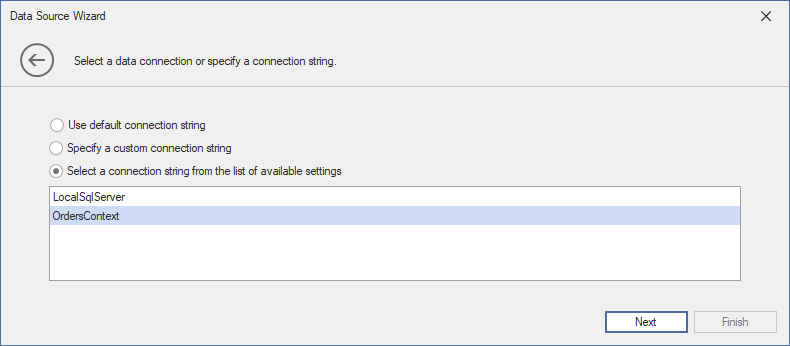
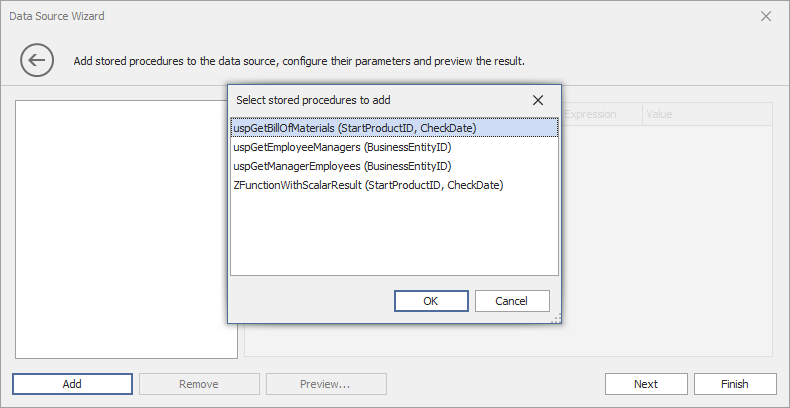
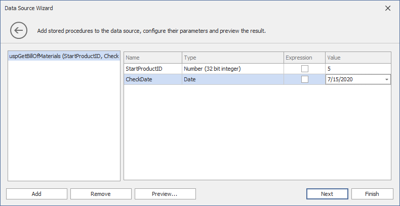
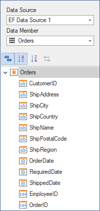

# Connect to EF Data Sources

To bind a dashboard to an Entity Framework data source from the current project, do the following:

## Create a Data Source in the Data Source Wizard

Click the **New Data Source** button in the **Data Source** ribbon tab.

### Select a Data Source and Specify Data Context  

On the first page of the invoked **Data Source Wizard** dialog, select **Entity Framework** and click **Next**.

On the next page, select the required data context and click **Next**.
	

### Select Data from the Database

On the next page, specify a connection string used to establish a data connection. The following options are available:

#### Default Connection String 

Choose the default connection string if it is specified in the application’s configuration file.

#### Custom Connection String 

Specify a custom connection string in the connection string editor. 

#### Predefined Connection String

Select an existing connection string available in the current project. 

### Add Stored Procedures (Optionally)

The next wizard page is available only if the current entity data model contains stored procedures. This page allows you to add stored procedures to the data source and configure their parameters.

Click **Add** and select the required stored procedures to add to the data source.

Specify the **Value** passed as a stored procedure parameter. Click the **Preview** button to preview data returned by the stored procedure call.

As an alternative, enable the **Expression** check box to invoke the Expression Editor dialog. In the dialog, you can specify the expression or select an existing dashboard parameter to use it as a stored procedure parameter.

### Apply filter Criteria
	
On the last page, you can apply filter criteria to the resulting query. Click **Finish** to create the data source.
	

### Result
		
The data source fields are displayed in the Data Source Browser:

