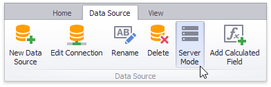
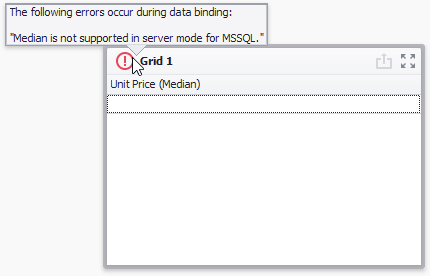

# Data Processing Modes
DevExpress Dashboard supports two data processing modes that are used to perform data-related operations (such as grouping, filtering, etc.).
* In **server mode**, data-related operations are performed on the database server side. For instance, when you apply [filtering](../data-shaping/filtering.md) to a dashboard item, the Dashboard Designer requests the required data automatically by sending a query containing a corresponding SELECT statement with the specified WHERE clause.
* In **client mode**, data-related operations are performed on the workstation side. In this mode, a compressed snapshot of aggregated data is loaded into a workstation memory. This reduces memory consumption and improves the speed of client-side data shaping operations using several techniques: data compression, various data grouping and multi-threading algorithms, etc.

> [!TIP]
> Note that performance in **server**/**client** modes depends on multiple factors such as database structure, server workload, etc. To decide which mode to use, test both.

> [!NOTE]
> In [OLAP](connecting-to-olap-cubes.md) mode, data processing is performed using the _server mode_ specified for the Analysis Services instance. To learn more, see [Determine the Server Mode of an Analysis Services Instance](https://msdn.microsoft.com/en-us/library/gg471594.aspx).

## Change Data Processing Mode
Different data source types allow you to manage the current data processing mode in different ways.
* For [SQL data sources](connecting-to-sql-databases.md), you can switch between data processing modes manually. To enable or disable **server mode** for the [selected](../ui-elements/data-source-browser.md) data source, use the **Server Mode** button located on the **Data Source** ribbon tab.
	
	
	
	**Server mode** is supported for the SQL data sources created using the Data Source wizard and supplied with data using the [Query Builder](../work-with-data/using-the-query-builder.md).
* [Excel Data Source](binding-to-microsoft-excel-workbooks.md) supports **client mode** only.
* [Extract Data Source](binding-to-extract-data-sources.md) works in **client mode**.

## Server Mode Limitations
In **server mode**, the Dashboard does not have simultaneous access to bound data in its entirety. This imposes some limitations.
* [Stored procedures](../work-with-data/stored-procedures.md) are not supported in server mode.
* Stored procedures executed using custom SQL are not supported in server mode.
* Some [calculated fields](../work-with-data/creating-calculated-fields.md) cannot be evaluated in server mode.
* The [Count Distinct](../data-shaping/summarization.md) summary function is not supported for the following database engines:
	* Microsoft Access
	* Microsoft SQL Server CE
* The [Median](../data-shaping/summarization.md) summary function is supported for the Oracle data provider only.
* The [Bound Image](../dashboard-item-settings/images/image-types-overview.md) and [Grid](../dashboard-item-settings/grid.md) dashboard items cannot display images from the following types of databases:
	* Microsoft SQL Server
	* MySQL
	* PostgreSQL

## Data Processing Errors
The Dashboard Designer provides the capability to display errors that occurred during data processing operations (such as changing measure [summary types](../data-shaping/summarization.md), [calculation](../data-analysis/window-calculations.md) errors, etc.). For instance, the [Grid](../dashboard-item-settings/grid.md) below shows an error when the summary type of the _Extended Price_ measure is set to [Median](../data-shaping/summarization.md) in server mode.

To see the error message, hover the mouse pointer over the  icon.