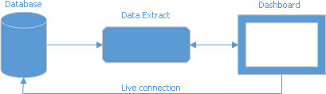

# Supported Data Sources
The Dashboard Designer allows you to establish a connection to various data sources such as SQL databases, Microsoft Excel workbooks, XML/CSV data files or OLAP cubes.

The following data source types are supported.
* [SQL Data Source](#sql-data-source)
* [OLAP Data Source](#olap-data-source)
* [Microsoft Excel Workbooks/CSV Files](#microsoft-excel-workbookscsv-files)
* [JSON Data Source](#json-data-source)
* [XPO Data Source](#xpo-data-source)
* [Extract Data Source](#extract-data-source)
* [Object Data Source](#object-data-source)
* [Entity Framework Data Source](#entity-framework-data-source)
* [Federated Data Source](#federated-data-source) 

## SQL Data Source
To connect to various SQL databases, the Dashboard Designer requires corresponding providers to be installed on your machine. The table below lists the supported data sources and the required data providers.

| SQL Data Source | Supported Versions | Provider | Database Provider Assembly | Download link |
|---|---|---|---|---|
| Microsoft SQL Server | 2005, 2008, 2008R2, 2012, 2014, 2016, 2005 Express Edition, 2008 R2 Express, 2012 Express, 2014 Express, 2016 Express, Azure SQL Database | .NET Framework Data Provider for SQL Server | System.Data.dll | Included in .NET Framework |
| Microsoft Access | 2000 or higher | Microsoft Jet OLE DB Provider / Microsoft Access Database Engine (ACE) | System.Data.dll | Microsoft Access 2000-2003 - [Microsoft Jet 4.0 Database Engine](https://support.microsoft.com/en-us/kb/239114) / Microsoft Access 2007 and later - [Access Database Engine](https://www.microsoft.com/en-us/download/details.aspx?id=13255) |
| Microsoft SQL Server CE | 3.5, 4.0 | .NET Framework Data Provider for SQL Server Compact | System.Data.SqlServerCe.dll | Included in .NET Framework |
| Oracle Database | 9i or higher | Oracle Data Provider for .NET / .NET Framework Data Provider for Oracle | Oracle.DataAccess.dll, Oracle.ManagedDataAccess.dll, System.Data.OracleClient.dll | [Download link](http://www.oracle.com/technetwork/topics/dotnet/index-085163.html) (Included in .NET Framework) |
| Amazon Redshift | n/a | .NET data provider for PostgreSQL | Npgsql.dll | [Download link](http://www.npgsql.org/) |
| Google BigQuery | n/a | DevExpress.DataAccess.BigQuery ADO.NET provider | DevExpress.DataAccess.BigQuery.dll | [Download link](https://www.nuget.org/packages/DevExpress.DataAccess.BigQuery) |
| Teradata | 13.0 or higher | .NET Data Provider for Teradata | Teradata.Client.Provider.dll | [Download link](https://downloads.teradata.com/download/connectivity/net-data-provider-for-teradata) |
| SAP Sybase Advantage | Advantage Database Server 9.1 or higher | Advantage .NET Data Provider | Advantage.Data.Provider.dll | [Download link](http://devzone.advantagedatabase.com/dz/content.aspx?Key=20&amp;Release=19&amp;Product=4&amp;Platform=11) |
| SAP Sybase ASE | Sybase Adaptive Server 12.0 or higher | SAP Sybase ASE Database Client | Sybase.Data.AseClient.dll | [Download link](http://scn.sap.com/community/developer-center/oltp-db) |
| SAP SQL Anywhere | 11 or higher | SAP SQL Anywhere Database Client | iAnywhere.Data.SQLAnywhere.dll | [Download link](http://scn.sap.com/docs/DOC-35857?d96a349c52fc4f68eea46a47ccb3d360) |
| IBM DB2 | 9.5 or higher | ADO.Net client from IBM | IBM.Data.DB2.dll | [Download link](https://www-01.ibm.com/support/docview.wss?rs=4020&amp;uid=swg21385217) |
| Firebird | 1.5 or higher, Dialect 3 | Firebird ADO.NET Data Provider | FirebirdSql.Data.Firebird.dll, FirebirdSql.Data.FirebirdClient.dll | [Download link](http://firebirdsql.org/en/net-provider/) |
| MySQL | 4.1 or higher | ADO.NET driver for MySQL | MySql.Data.dll | [Download link](http://dev.mysql.com/downloads/connector/net/) |
| Pervasive PSQL | 9.x or higher | PSQL ADO.NET Data Provider | Pervasive.Data.SqlClient.dll | [Download link](http://www.pervasive.com/database/Home/Products/psqlv12.aspx) |
| PostgreSQL | 7.x or higher | .NET data provider for PostgreSQL | Npgsql.dll | [Download link](http://www.npgsql.org/) |
| VistaDB | 4, 5 | VistaDB ADO.NET Provider | VistaDB.5.NET40.dll | [Download link](http://www.gibraltarsoftware.com/VistaDB) |
| SQLite | 3.x | ADO.NET provider for SQLite | System.Data.SQLite.dll | [Download link](https://system.data.sqlite.org/index.html/doc/trunk/www/index.wiki) |
| XML file | n/a | n/a | n/a | n/a |

To create a connection to a SQL data source, see [Binding to SQL databases](connecting-to-sql-databases.md).

## OLAP Data Source
To use the OLAP data source, the Dashboard Designer requires Microsoft Analysis Services OLE DB and Microsoft ADOMD.NET providers to be installed on your machine. To learn more, see [Data providers used for Analysis Services connections](https://msdn.microsoft.com/en-us/library/dn141152.aspx#bkmk_OLE).

The following OLAP servers are supported.
* Microsoft SQL Server 2000 Analysis Services
* Microsoft SQL Server 2005 Analysis Services
* Microsoft SQL Server 2008 Analysis Services
* Microsoft SQL Server 2008 R2 Analysis Services
* Microsoft SQL Server 2012 Analysis Services (Multi-dimensional mode)
* Microsoft SQL Server 2014 Analysis Services (Multi-dimensional mode)
* Microsoft SQL Server 2016 Analysis Services (Multi-dimensional mode)

To create a connection to an OLAP cube data source, see [Binding to OLAP cubes](connecting-to-olap-cubes.md).

## Microsoft Excel Workbooks/CSV Files
The following Microsoft Excel/text formats are supported.
* XLS
* XLSX
* XLSM
* CSV

To create a connection to Microsoft Excel workbooks or CSV files, see [Binding to Microsoft Excel Workbooks](binding-to-microsoft-excel-workbooks.md).

## JSON Data Source
The JSON data source retrieves data from:
* Web-service endpoint
* text file
* string

To create a JSON data source and specify connection parameters in the **Data Source Wizard**, see [Binding to JSON Data Sources](binding-to-json-data-sources.md).

## XPO Data Source
The XPO data source gets data from **eXpress Persistent Objects**.
To create an XPO data source and specify connection parameters, see [Binding to XPO Data Sources](binding-to-XPO-data-sources.md).

## Extract Data Source

**Extract Data Source** is a compressed snapshot of data from a regular data source.
This data is saved to a local file and can be updated from the original data source at any time.

 

 The extract data file is optimized for data grouping. It reduces the initial dashboard load time.
 A special in-memory cache allows you to improve performance when accessing extract data. 
                                                                    
 To create an Extract data source and specify connection parameters, see [Binding to Extract Data Sources](binding-to-extract-data-sources.md).

## Object Data Source

The Dashboard Designer provides a connection to an object data source defined in a separate class within a current project.

To create a connection to an Object data source, see [Binding to Object Data Sources](binding-to-object-data-sources.md).

## Entity Framework Data Source

Use the available data context to connect to EF data source. 

To create a connection to an EF data source, see [Connect to EF Data Sources](connect-to-ef-data-sources.md).

 ## Federated Data Source

 A federated data source integrates different data sources and provides uniform data access with a federated query.

 Federated data source supports the following data source types:

* [SQL Data Source](#sql-data-source)
* [Excel Data Source](#microsoft-excel-workbookscsv-files)
* [Object Data Source](#object-data-source)

To create a Federated data source with the **Data Source Wizard**, see [Binding to Federated Data Source](binding-to-federated-data-source.md).

