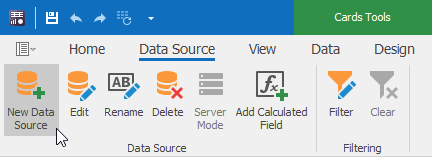
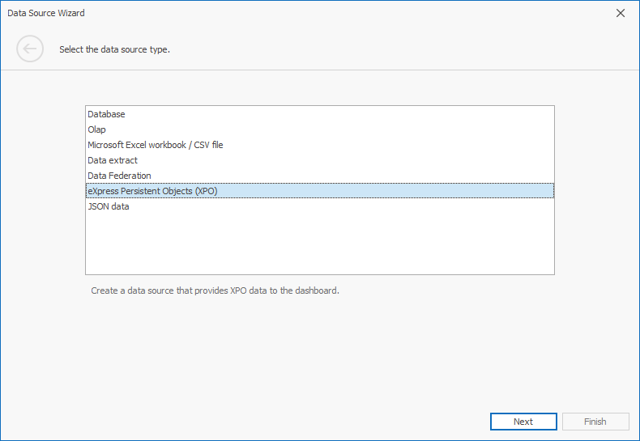
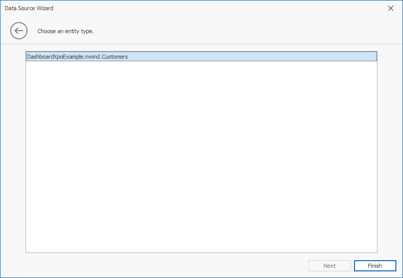

# Binding to XPO Data Sources

To connect to the XPO data source, perform the following steps.

1. Click the **New Data Source** button in the **Data Source** ribbon tab.

   

2. On the first page of the invoked **Data Source Wizard** dialog, select **eXpress Persistent Objects (XPO)** and click Next. 
 
   

3. Choose the available entity type.

   

