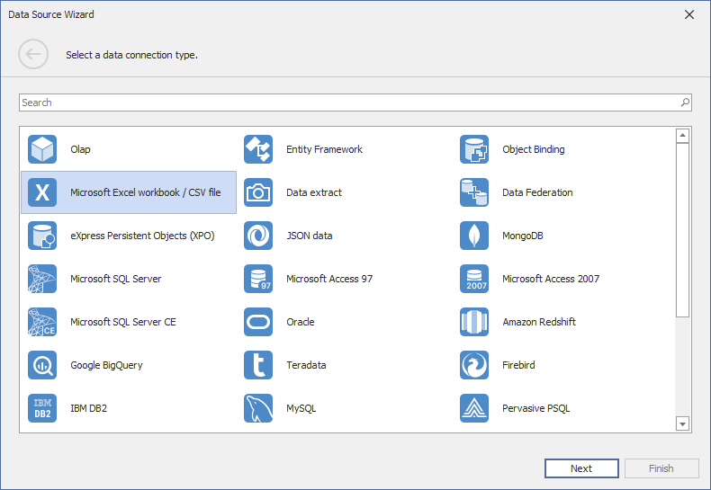
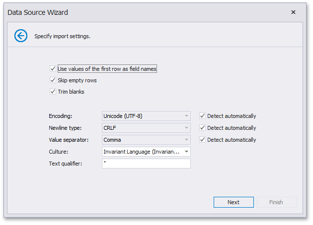

# Binding to CSV Files
The Dashboard Designer allows you to select data from CSV files.

To bind a dashboard to a CSV file, do the following.
1. Click the **New Data Source** button in the **Data Source** ribbon tab.
	
	
2. On the first page of the invoked **Data Source Wizard** dialog, select the **Microsoft Excel workbook / CSV file** and click **Next**.
	
	
3. On the next page, locate the required CSV file by clicking the ellipsis button and selecting the file.
	
	
	
	Click **Next**.
4. Then, specify import settings used to extract data from the CSV file.
	
	
	
	The following options can be specified.
	* **Use values of the first row as field names** - Specifies whether to use the values of the first row as field names. If you disable this option, field names will be generated automatically.
	* **Skip empty rows** - Specifies whether or not to include the empty rows into the resulting data source.
	* **Trim Blanks** - Specifies whether to remove all leading and trailing white-space characters from each value in the CSV document.
	* **Encoding** - Specifies the character encoding of the CSV document. You can use the **Detect automatically** option to specify whether character encoding is automatically determined.
	* **Newline type** - Specifies the character used to identify a new line in a CSV document. You can use the **Detect automatically** option to specify whether the character used to identify a new line is automatically determined.
	* **Value separator** - Specifies a character used to separate values in a CSV document. You can use the **Detect automatically** option to specify whether the character used to separate values in a CSV document is determined automatically.
	* **Culture** - Specifies the culture information used to parse the data being imported.
	* **Text Qualifier** - Specifies the character that encloses values in the CSV document.
	
	Click **Next**.
5. On the final page, you can select columns to be included to a data source and specify their settings. The **Name** column allows you to specify the column name while **Type** allows you to specify its type.
	
	
	
	Click **Finish** to create a data source. This creates the data source and displays its fields in the [Data Source Browser](../ui-elements/data-source-browser.md).