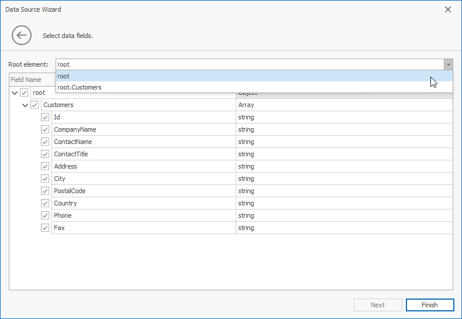

# Binding to JSON Data Sources

Jason Data Sources allows you to extract JSON data from a Web-service endpoint URI, text file, or a string in JSON format.
To bind a dashboard to Jason Data Sources, do the following.

1. Click the **New Data Source** button in the **Data Source** ribbon tab.

    

2. On the first page of the invoked **Data Source Wizard** dialog, select **JSON data source** and click Next. 

    
   

3.  Select the JSON source type and specify the JSON data location. 
     
     * Web Service Endpoint (URI)

       Specify a URL to a file in the JSON format.

       

      On the next page specify the Web Service Endpoint's request parameters (username and password, HTTP headers, or query parameters).

       

    * JSON String

       Provide data in the JSON format. 

       
       
    * JSON File

       Specify the JSON file location.

       

4. Select the root node and click **Finish**

    

