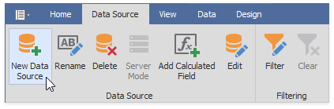

# Binding to JSON Data Sources

Jason Data Sources allows you to extract JSON data from a Web-service endpoint URI, text file, or a string in JSON format.
To bind a dashboard to Jason Data Sources, do the following.

1. Click the **New Data Source** button in the **Data Source** ribbon tab.

    

2. On the first page of the invoked **Data Source Wizard** dialog, select **JSON data source** and click Next. The wizard guides you to specify the JSON data location and select the root node.

    >[!ImageGallery]

    >
    >
    >
    >
