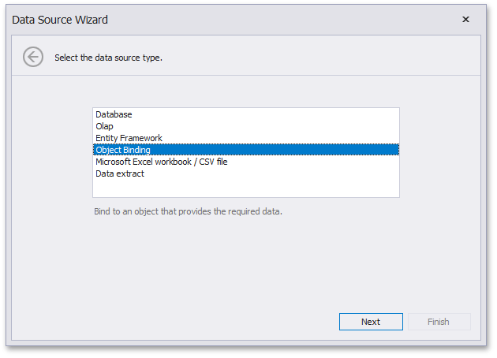
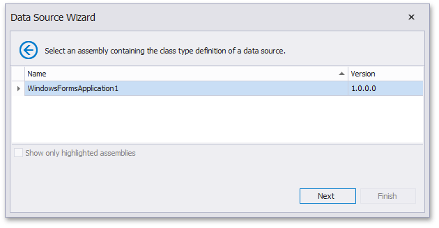
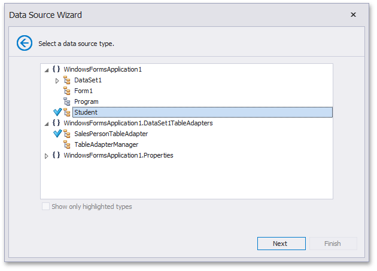
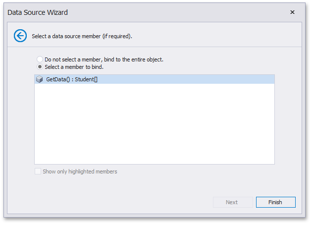

# Binding to Object Data Sources

To bind a dashboard to an object data source, do the following.

1. Click the New Data Source button in the Data Source ribbon tab. 

   

2. If you are allowed by your application vendor to connect an object data source, select **Object Binding**, click **Next**.

   

3. On the next page, select the assembly containing the definition of the required class.

   

   Click **Next**.

4. Select the class providing the required data and click **Next**.

   

   For instance, this can be a custom class providing the required data or any TableAdapter used to query a database.

5. On the final page, select the required data member used to obtain data and click **Finish**.

   

