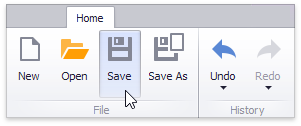
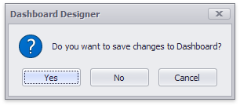
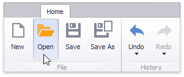

# Save a Dashboard
A dashboard provides the capability to save a dashboard definition (dashboard items, data sources, data binding, layout settings, etc.) to an XML file, and restore the dashboard from an XML file.

## Saving a Dashboard
Once a dashboard is designed, you can save its definition to an XML file. In the **Dashboard Designer**, this can be accomplished in the following ways.
* You can save the dashboard by clicking the **Save** or **Save As** button in the Ribbon menu of the Designer.
	
	
	
	This invokes the **Save As** dialog, which allows you to locate the folder in which you wish to store your file.
* The dashboard can be saved when the window containing the Dashboard Designer is closed. If the dashboard has been modified since the last save, a save confirmation dialog will be invoked.
	
	

## Loading a Dashboard
A dashboard previously saved to an XML file can be loaded to the Dashboard Designer.

You can open the dashboard by clicking the **Open** button in the Ribbon menu of the Designer.

This invokes the **Open File** dialog, which allows you to locate the required dashboard XML file.