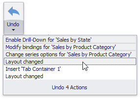

# Undo and Redo Operations
The **Dashboard Designer** keeps track of all user actions, and allows you to undo or repeat them using the **Undo**/**Redo** buttons.

To undo/redo the last action, use the following buttons.

To undo/redo several actions at once, click the arrow next to **Undo**/**Redo** button and select the actions in the list that you want to undo/redo. 

