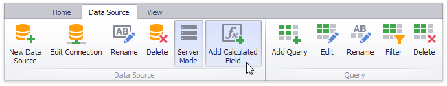
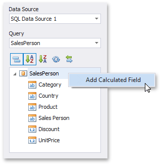
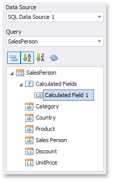

# Creating Calculated Fields
The Dashboard Designer provides the capability to create calculated fields that allow you to apply complex expressions to data fields that are obtained from the dashboard's data source. You can use these fields in data visualizations as regular data source fields.
* [Creating a Calculated Field](#creating-a-calculated-field)
* [Editing a Calculated Field](#editing-a-calculated-field)

> [!NOTE]
> Note that calculated fields are not supported for [OLAP](../provide-data/connecting-to-olap-cubes.md) data sources.

## <a name="creating-a-calculated-field"/>Creating a Calculated Field
After you have created a data source, you can add a new calculated field based on the existing data source fields.

To create a calculated field, select the required data source (and the required [query](manage-sql-queries.md)/data member, if applicable) in the [Data Source Browser](../ui-elements/data-source-browser.md) and click the **Add Calculated Field** button in the Ribbon's Data Source tab...

...or right-click the Field List and select **Add Calculated Field** in the context menu.

This invokes the **Expression Editor** dialog, which allows you to specify an [expression](../data-analysis/expression-constants-operators-and-functions.md) that will be used to obtain calculated field values. Here, you can construct the required expression.

You can use the following elements in expressions.
* Functions
	
	> [!NOTE]
	> To learn how to use **Aggregate** functions, see [Aggregations](../data-analysis/aggregations.md). The [Expression Operators, Functions and Constants](../data-analysis/expression-constants-operators-and-functions.md) topic lists the functions (**DateTime**, **Math**, **String**, etc.) supported by expressions.
* Operators
* Columns
* Constants
* [Parameters](../data-analysis/using-dashboard-parameters.md)

After the expression has been specified, click **OK**. This displays a new calculated field in the data source structure.

Now you can specify the required calculated field type, change its default name, etc.

## <a name="editing-a-calculated-field"/>Editing a Calculated Field
To edit a calculated field, use its context menu.

This menu contains the following items.

| Item | Description |
|---|---|
| **Edit Expression...** | Invokes the [Expression Editor](../../../../interface-elements-for-desktop/articles/expression-editor.md) dialog, which allows you to change an expression for an existing calculated field. |
| **Field Type** | Specifies the type of the calculated field. |
| **Rename** | Changes the calculated field name. |
| **Delete** | Removes the existing calculated field from the data source. |