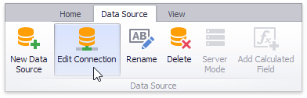
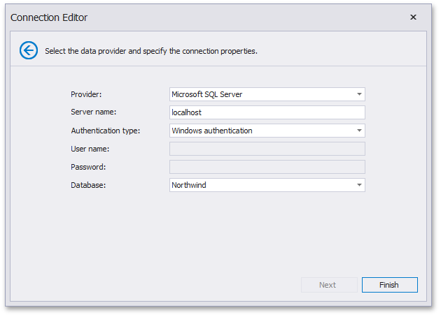

# Edit Connection Parameters
After you [connected](../provide-data/connecting-to-sql-databases.md) to the data store and selected the required data, you can edit the connection parameters used to establish a connection.

To edit connection parameters for the selected data source, click the **Edit Connection** button in the **Data Source** ribbon tab.

In the invoked **Connection Editon** dialog, click **Next**.

On the next page, you can specify new connection parameters.

