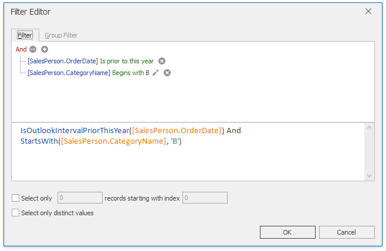
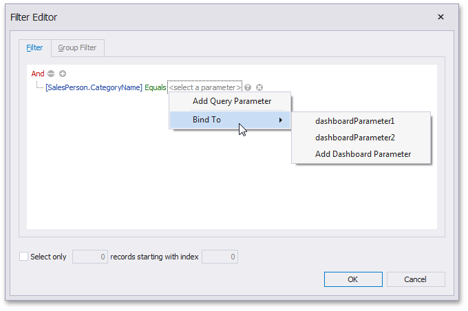
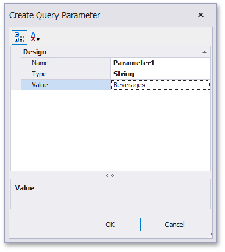
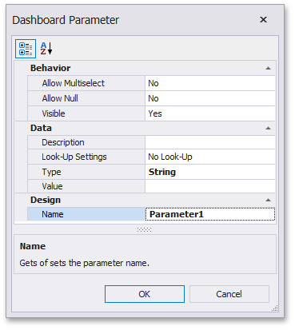

# Filter Queries
SQL queries constructed in the [Query Builder](using-the-query-builder.md) can be filtered by including WHERE clauses to the query. Filtering can be applied to either underlying or aggregated data. You can also limit the number of returned records when filtering data.
* [Invoke the Filter Editor](#invoke-the-filter-editor)
* [Filter Data](#filter-data)
* [Add Limits](#add-limits)

## <a name="invoke-the-filter-editor"/>Invoke the Filter Editor
To filter data in the Query Builder, click the **Filter...** button... in the **Data Source** ribbon tab...

... or use a corresponding button within the [Query Builder](using-the-query-builder.md). This will invoke the [Filter Editor](../../../../interface-elements-for-desktop/articles/filter-editor/filter-data-via-the-filter-editor.md) dialog, which allows you to build filter criteria.

The **Filter** tab allows you to filter underlying data while the **Group Filter** tab provides the capability to filter data aggregated on the server side.

## <a name="filter-data"/>Filter Data
In the Filter Editor, you can compare a field value with the following objects.
* _A static value_ (represented by the  icon). Click this button to switch to the next item mode ("another field value") to compare the field value with another field value.
* _Another field value_ (represented by the  icon). Click this button to switch to the next item mode (“parameter value”) to compare the field value with a parameter value.
* _A parameter value_ (represented by the  icon). Click this button to switch back to the initial mode ("static value") to compare the field value with a static value.

Thus, you can pass the [query parameter](pass-query-parameters.md) to the filter string. To do this, click the  button, then click the  button and finally click _&#60;select a parameter&#62;_.

In the invoked popup menu, you can choose from the following options.
* **Add Query Parameter** - allows you to create a new [query parameter](pass-query-parameters.md). The following dialog will be invoked.
	
	
	
	In this dialog, you can specify a parameter's name (**Name**), type (**Type**) and value (**Value**).
	
	If the current query already contains query parameters, they will be displayed within the popup menu.
* **Bind to** - allows you to pass a [dashboard parameter](../data-analysis/using-dashboard-parameters/creating-parameters.md) to a filter string. You can choose from the list of predefined dashboard parameters or create a new dashboard parameter by selecting **Add Dashboard Parameter**. If you selected **Add Dashboard Parameter**, the following dialog will be invoked.
	
	
	
	In this dialog, you can specify settings of the dashboard parameter to be created. To learn more, see [Creating Parameters](../data-analysis/using-dashboard-parameters/creating-parameters.md).
	
	After you specified the required settings, click **OK**. A new dashboard parameter along with a new query parameter will be created. Note that created dashboard and query parameters will be bound automatically.

The **Group Filter** tab of the Filter Editor allows you to apply filtering to grouped/aggregated data fields by including HAVING clauses to the query. Grouping and aggregation are managed by the **Group By** and **Aggregate** options in the Query Builder. To learn more, see the **Edit Column Settings** paragraph in the [Query Builder](using-the-query-builder.md) topic.

## <a name="add-limits"/>Add Limits
The Filter Editor also allows you to limit the number of returned records. To do this, enable the **Select only** checkbox and specify the number of records to be returned.

You can also skip the required number of records in the returned dataset by specifying the **records starting with index** value.

> [!NOTE]
> Note that the **Sorting type** should be specified in the Query Builder to enable the capability to skip the specified number of records. To learn how to apply sorting, see the **Edit Column Settings** paragraph in the [Query Builder](using-the-query-builder.md) topic.