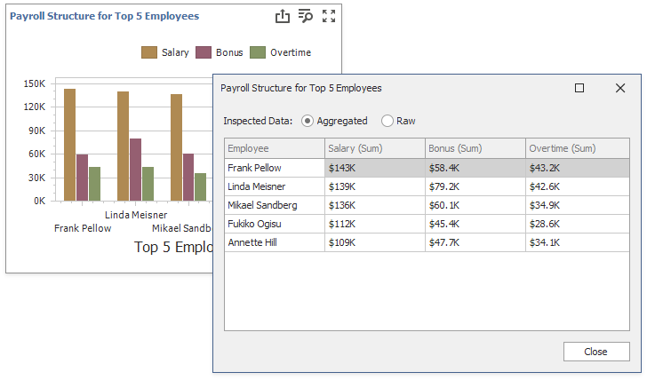
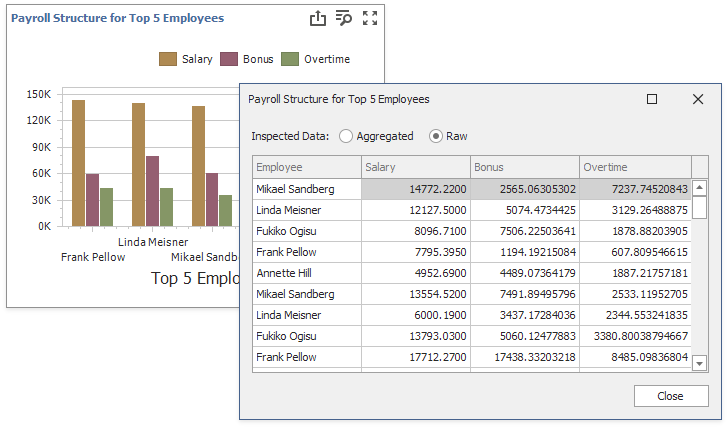

# Data Inspector
**Data Inspector** is a dialog window that displays raw and aggregated data. 

## Overview

To invoke the Data Inspector window, click the "Inspect Data" button  in the [dashboard item caption](../dashboard-layout/dashboard-item-caption.md) or select the "Inspect Data" context menu item. 

## Aggregated (Displayed) Data

The data shown as _Aggregated_ is retrieved from the dashboard item's data storage.

The columns are:

* [Dimensions](../dashboard-item-settings/grid/columns/dimension-column.md), except the **Sparkline**.
* [Measures](../dashboard-item-settings/grid/columns/measure-column.md). A list of dimensions does not include unbound measures (the measures without a DataMember, such as [Totals](../dashboard-item-settings/grid/totals.md) and the number of points in a [Cluster](../dashboard-item-settings/geo-point-maps/clustering.md).
 * The [Sparkline](../dashboard-item-settings/grid/columns/sparkline-column.md) is displayed as a column.

## Raw Data

Raw data is the dashboard item's underlying data. 

Raw Data:

