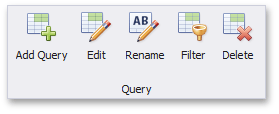

After you [connect](../../../../dashboard-for-desktop/articles/dashboard-designer/providing-data/connecting-to-sql-databases.md) to the data store and select the required data, you can edit the resulting query/[stored procedure](../../../../dashboard-for-desktop/articles/dashboard-designer/working-with-data/stored-procedures.md) or add another query/stored procedure to the data source.

To manage queries for the current data source, use buttons from the **Query** group in the **Data Source** ribbon tab.

You can perform the following actions.
* **Add Query** - Adds a new query to the data source. Clicking this button invokes the [Query Editor](../../../../dashboard-for-desktop/articles/dashboard-designer/working-with-data/using-the-query-editor.md) dialog that allows you to create a new query by invoking the [Query Builder](../../../../dashboard-for-desktop/articles/dashboard-designer/working-with-data/using-the-query-builder.md) or to select the existing [stored procedure](../../../../dashboard-for-desktop/articles/dashboard-designer/working-with-data/stored-procedures.md).
* **Edit** - Modifies the selected query/stored procedure using the [Query Editor](../../../../dashboard-for-desktop/articles/dashboard-designer/working-with-data/using-the-query-editor.md).
* **Rename** - Renames the selected query.
* **Filter** - Filters the selected query. To learn more, see the [Filter Queries](../../../../dashboard-for-desktop/articles/dashboard-designer/working-with-data/filter-queries.md) topic.
* **Delete** - Removes the selected query.