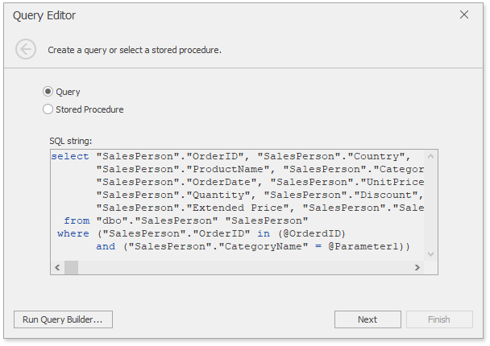
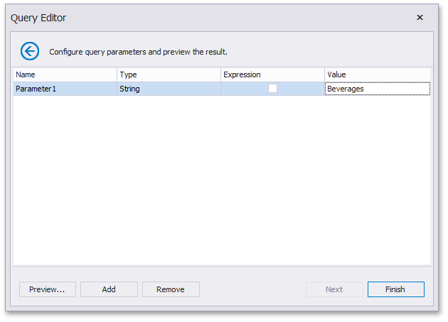

# Pass Query Parameters
The [Query Builder](using-the-query-builder.md) allows you to add query parameters when creating a filter criteria. To specify settings of an added query parameter, click **Next** in the [Query Editor](using-the-query-editor.md) dialog.

On the next page, add a new parameter (using the **Add** button) and specify its settings.

* **Name** - Specifies a parameter's name.
* **Type** - Specifies the parameter's type.
* **Expression** - Specifies whether an expression is used to specify a parameter's value.
* **Value** - Specifies the parameter's value. If the **Expression** check box is checked, you can invoke the **Expression Editor** dialog to specify the required [expression](../../dashboard-designer/data-analysis/expression-constants-operators-and-functions.md) or select an existing [dashboard parameter](../data-analysis/using-dashboard-parameters/creating-parameters.md) to pass to the SQL query.

Use the **Remove** button to remove query parameters.

Click the [Preview...](preview-data.md) button to preview the query result. Then, click **Finish** to complete query modification.