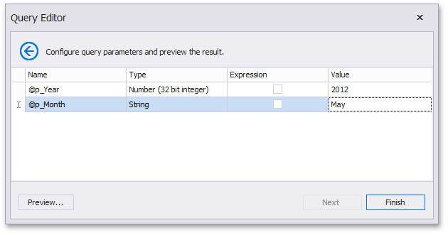

# Stored Procedures
If you use a stored procedure to supply the dashboard with data, you should specify the stored procedure parameters. In the [Query Editor](../../../../dashboard-for-desktop/articles/dashboard-designer/working-with-data/using-the-query-editor.md) dialog, select the required stored procedure and click **Next**.

On the next page, you can specify the parameter settings.

* **Name** - Displays the parameter name.
* **Type** - Displays the parameter type.
* **Expression** - Specifies whether the expression is used to specify a parameter value.
* **Value** - Specifies a parameter value. If the **Expression** check box is checked, you can invoke the [Expression Editor](../../../../interface-elements-for-desktop/articles/expression-editor.md) dialog to specify the required expression or select an existing [dashboard parameter](../../../../dashboard-for-desktop/articles/dashboard-designer/data-analysis/using-dashboard-parameters.md) to use it as a stored procedure parameter.

Click the [Preview...](../../../../dashboard-for-desktop/articles/dashboard-designer/working-with-data/preview-data.md) button to preview the query result. Then, click **Finish** to complete query modifying.