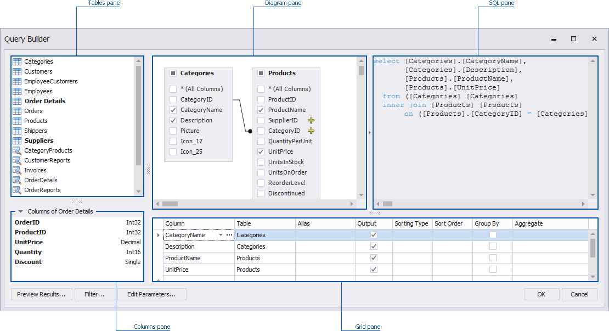
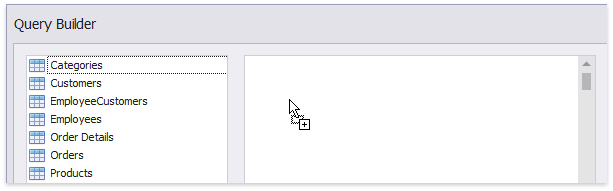
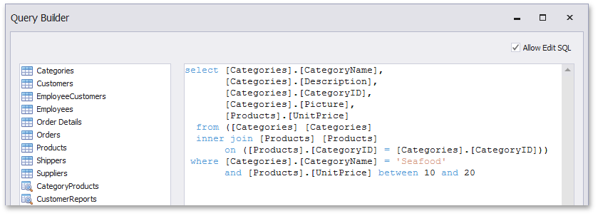

# Using the Query Builder
In the **Query Builder** dialog, you can add data tables and views to the data source, and select which columns to include. The Query Builder automatically joins the related tables, so all you need to do is drag-and-drop.

* [Add Tables](#add-tables)
* [Join Tables](#join-tables)
* [Edit Column Settings](#edit-column-settings)
* [Filter Data](#filter-data)
* [Customize SQL Query](#customize-sql-query)
* [Preview Data](#preview-data)

## <a name="add-tables"/>Add Tables
To add the required tables/views to a data source, double-click the table (or view) or drag-and-drop it from the **Tables** pane onto the **Diagram** pane.

Then, select the required columns.

## <a name="join-tables"/>Join Tables
Note that if at least one table has been added to the **Diagram** pane, the **Tables** pane highlights tables that have a relationship with any of the recently added tables.

To join the already added table with an another table, do one of the following.
* Click the  button next to the foreign key column (_SupplierID_ and _CategoryID_ in the image above).
* Drag and drop the highlighted table from the **Tables** pane to **Diagram** pane.

The Query Builder will display a relationship between tables.

To edit this relation, select it and use its context menu.

The following commands are available.
* **Edit Relation** - Allows you to edit the selected relation. Clicking this menu item invokes the **Join Editor** dialog.
	
	
	
	First, check the join type. You can specify it in the **Join type** combo box (_Inner join_ or _Left outer join_).
	To edit column and table names in the existing condition, click the name you wish to replace and choose a different name from the popup menu.
	
	> [!NOTE]
	> Note that the **Join Editor** dialog will be invoked automatically if you join tables that do not have a relationship at the database level.
* **Delete Relation** - Removes the selected relation. Note that this action removes the joined table(s).

## <a name="edit-column-settings"/>Edit Column Settings
After you have added the tables and selected the required columns, you can change settings for each column in the **Grid** pane.

The following settings are available for each column.
* Use **Column** to select the required column from the combo box or add a new column. If necessary, you can customize a column expression. To do this, click the ellipsis button for the required column and specify the [expression](../../dashboard-designer/data-analysis/expression-constants-operators-and-functions.md) in the invoked **Expression Editor** dialog.
* The **Table** column displays corresponding table names.
* The **Alias** column allows you to specify the column alias.
	
	> [!NOTE]
	> Note that aggregated columns should always have an alias.
* The **Output** column allows you to choose whether to include specific columns to the query.
* Use the **Sorting type** combo box to specify the sort order of column values. The **Sort order** column allows you to specify the order in which several columns are sorted.
* The **Group By** statement is used in conjunction with the aggregate functions to group the result-set by one or more columns.
* The **Aggregate** option allows you to specify the aggregate function used to aggregate column values.
	
	> [!NOTE]
	> Note that you should apply aggregation/grouping either to all columns or to none of them.

## <a name="filter-data"/>Filter Data
To filter data in the Query Builder, click the **Filter...** button. This will invoke the **Filter Editor** dialog, which allows you to build filter criteria.

To learn more, see [Filter Queries](filter-queries.md).

## <a name="customize-sql-query"/>Customize SQL Query
> [!IMPORTANT]
> Note that the Query Builder does not allow you to use custom SQL queries by default.

After you add the required tables, you can customize the automatically generated SQL query. To do this, enable the **Allow Edit SQL** check box and edit the SQL query displayed in the **SQL** pane.

For instance, you can add a WHERE clause to the SQL expression.

> [!NOTE]
> Note that if you edit the automatically generated query and uncheck the **Allow Edit SQL** check box, your changes will be discarded, and the generated query will be restored.

## <a name="preview-data"/>Preview Data
The Query Builder allows you to preview data for the created SQL query. To do this, click the **Preview Results...** button.

This invokes the [Data Preview](preview-data.md) window containing data returned after executing the query.