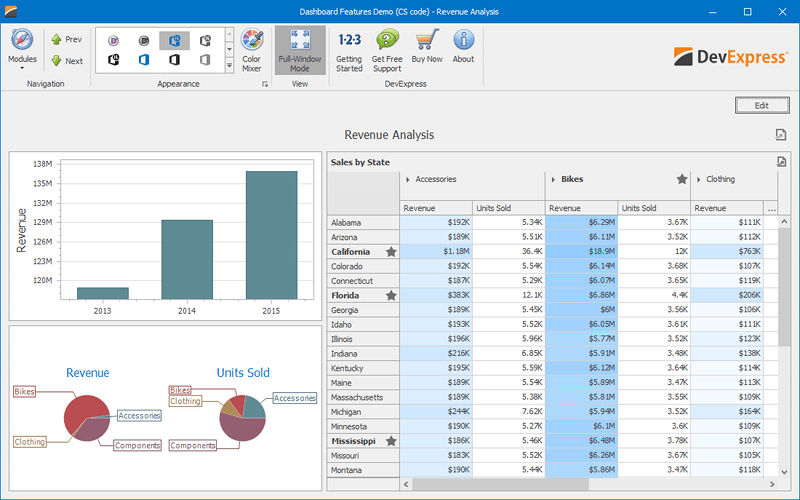

# Dashboard Viewer
The **Dashboard Viewer** provides the capability to display dashboards in Windows Forms applications.

## Data Presentation
The topics in this section provide information on how the **Dashboard Viewer** presents data.
* [Data Presentation Basics ](../../dashboard-for-desktop/articles/dashboard-viewer/data-presentation/data-presentation-basics.md)
* [Master Filtering](../../dashboard-for-desktop/articles/dashboard-viewer/data-presentation/master-filtering.md)
* [Drill-Down](../../dashboard-for-desktop/articles/dashboard-viewer/data-presentation/drill-down.md)
* [Dashboard Layout](../../dashboard-for-desktop/articles/dashboard-viewer/data-presentation/dashboard-layout.md)

## Dashboard Parameters
This topic describes how to change dashboard parameter values.
* [Requesting Parameter Values](../../dashboard-for-desktop/articles/dashboard-viewer/dashboard-parameters/requesting-parameter-values.md)

## Printing and Exporting
A Dashboard Viewer provides the capability to print or export both individual items of a dashboard, as well as the entire dashboard.
* [Printing and Exporting](../../dashboard-for-desktop/articles/dashboard-viewer/printing-and-exporting.md)

## Dashboard Items
Dashboard items are used to present information in various ways.
* [Chart](../../dashboard-for-desktop/articles/dashboard-viewer/dashboard-items/chart.md)
* [Scatter Chart](../../dashboard-for-desktop/articles/dashboard-viewer/dashboard-items/scatter-chart.md)
* [Grid](../../dashboard-for-desktop/articles/dashboard-viewer/dashboard-items/grid.md)
* [Pies](../../dashboard-for-desktop/articles/dashboard-viewer/dashboard-items/pies.md)
* [Cards](../../dashboard-for-desktop/articles/dashboard-viewer/dashboard-items/cards.md)
* [Gauges](../../dashboard-for-desktop/articles/dashboard-viewer/dashboard-items/gauges.md)
* [Pivot](../../dashboard-for-desktop/articles/dashboard-viewer/dashboard-items/pivot.md)
* [Choropleth Map](../../dashboard-for-desktop/articles/dashboard-viewer/dashboard-items/choropleth-map.md)
* [Geo Point Maps](../../dashboard-for-desktop/articles/dashboard-viewer/dashboard-items/geo-point-maps.md)
* [Range Filter](../../dashboard-for-desktop/articles/dashboard-viewer/dashboard-items/range-filter.md)
* [Image](../../dashboard-for-desktop/articles/dashboard-viewer/dashboard-items/image.md)
* [Text Box](../../dashboard-for-desktop/articles/dashboard-viewer/dashboard-items/text-box.md)
* [Treemap](../../dashboard-for-desktop/articles/dashboard-viewer/dashboard-items/treemap.md)
* [Filter Elements](../../dashboard-for-desktop/articles/dashboard-viewer/dashboard-items/filter-elements.md)