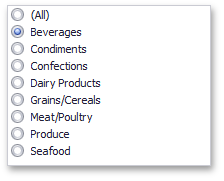

Filter elements provide the capability to [filter](../../../../dashboard-for-desktop/articles/dashboard-viewer/data-presentation/master-filtering.md) other dashboard items.
* [Combo Box](#combo-box)
* [List Box](#list-box)
* [Tree View](#tree-view)

## <a name="combo-box"/>Combo Box
The **Combo Box** dashboard item allows you to select a value(s) from the drop-down list.
* The **Standard** type allows you to select only a single value.
	
	
* The **Checked** type allows you to select multiple values in the invoked drop-down list.
	
	

## <a name="list-box"/>List Box
The **List Box** dashboard item allows you to select a value(s) from the list.
* The **Checked** type allows you to select multiple values in the list box.
	
	
* The **Radio** type allows you to select only a single value in the radio group.
	
	

## <a name="tree-view"/>Tree View
The **Tree View** dashboard item displays values in a hierarchical way and allows you to expand/collapse nodes.

