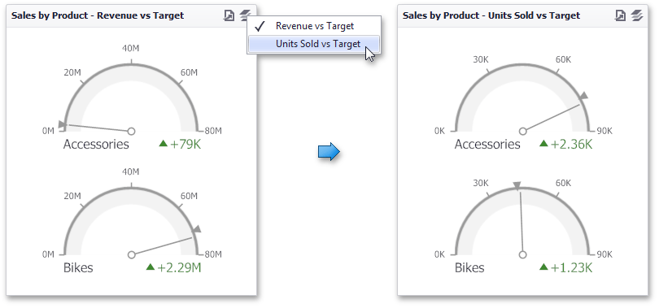

# Data Presentation Basics
The **Gauge** dashboard item displays a series of gauges. Each gauge can communicate two values - one with a needle and the other with a marker on the scale.

The **Gauge** dashboard item can illustrate the difference for various sets of values. You can switch between these sets using the **Values** button (the  icon) in the dashboard item [caption](../../../../../dashboard-for-desktop/articles/dashboard-viewer/data-presentation/dashboard-layout.md) or in the context menu.

