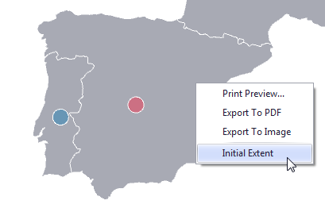

The **Dashboard** supports three types of **Geo Point** maps.
* The **Geo Point Map** dashboard item allows you to place callouts on the map using geographical coordinates.
	
	
* The **Bubble Map** dashboard item allows you to place bubbles on the map. Each bubble can represent data via its weight and color.
	
	
* The **Pie Map** dashboard item allows you to display pies on the map. Each pie visualizes the contribution of each value to the total. 
	
	

## Map Zooming and Scrolling
You can use the mouse wheel to change the current zoom level for a map. To scroll the map, hold down the left mouse button and drag it.

To move to the initial zooming and scrolling state, click the **Initial Extent** menu item in the map's context menu.

## Tooltip
A **Geo Point Map** dashboard item can display a tooltip that shows information on a hovered callout/bubble/pie.

