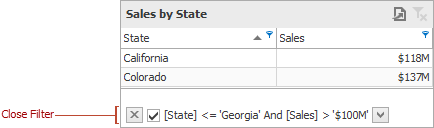
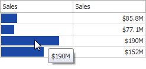

# Data Presentation Basics
The **Grid** displays data in a two-dimensional table that supports four types of columns.

* The **dimension column** displays values from the bound data item "as is".
* The **measure column** displays summaries calculated from data in the bound data item.
* The **delta column**, bound to two measures, calculates summaries for both measures, and displays the difference between these summaries.
* The **sparkline column** visualizes the variation of summary values over time.

## Sort Grid Rows
To sort records by a column's values and replace existing sort conditions that are applied to the current or other columns, click the target column's header until an _Up_ or _Down_ arrow icon is displayed within the header. The _Up_ and _Down_ arrows indicate ascending and descending sort orders, respectively.

To sort records by a column's values while preserving existing sort conditions, click a column header while holding the **SHIFT** key until an _Up_ or _Down_ arrow icon is displayed within the header.

To remove sorting by a column, click a column header while holding down the **CTRL** key.

## Filter Grid Data
To filter grid data, click the filter button (the  icon) and select the required filter value in the invoked filter dropdown list.

Click **Custom** to construct filter criteria involving up to two conditions. This will invoke the **Custom AutoFilter** dialog, allowing you to compare a column with one or two values.

To clear the filter applied to a specific column, invoke the filter dropdown list and click **All**.

To clear all filter criteria, click the **Close Filter** button within the Filter Panel.

## Tooltips
A Grid dashboard item can display a tooltip when the mouse pointer is hovered over the bar in the measure column.

The tooltip shows the value in the measure column as text.

When the mouse pointer is hovered over the cell in the sparkline column, the tooltip can display start/end values and minimum/maximum values.

