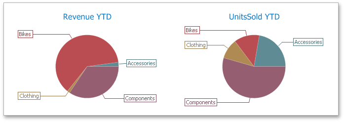

The **Pie** dashboard item displays a series of pies or donuts that represent the contribution of each value to a total.

## Tooltip
A Pie dashboard item can display a tooltip that shows information about the hovered pie segment.

