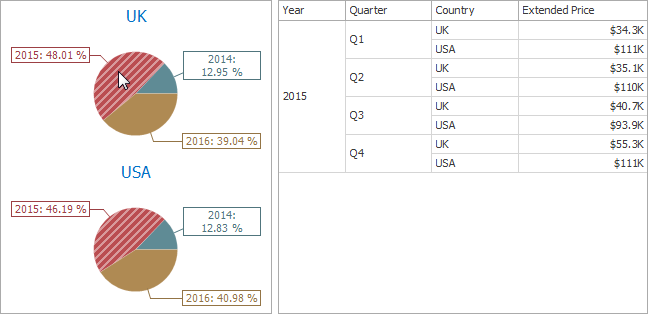
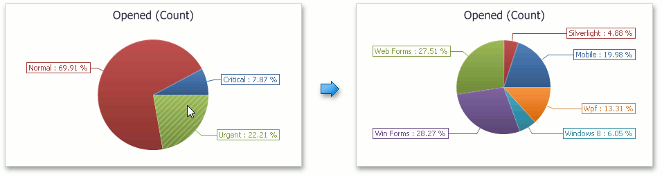

This topic describes features that enable interaction between the **Pie** and other dashboard items. These features include **Master Filtering** and **Drill-Down**.

## Master Filtering
The **Dashboard** allows you to use any data aware dashboard item as a filter for other dashboard items (**Master Filter**). To learn more about filtering concepts common to all dashboard items, see the [Master Filtering](../../../../../dashboard-for-desktop/articles/dashboard-viewer/data-presentation/master-filtering.md) topic.

The Pie dashboard item supports filtering by **argument** or **series** values.
* **Filtering by Arguments**
	
	When filtering by arguments is enabled, you can click a pie segment to make other dashboard items only display data related to the selected argument value.
	
	
* **Filtering by a Series**
	
	When filtering by a series is enabled, you can click a pie to make other dashboard items display only data related to the selected pie.
	
	
* **Filtering by a Points**
	
	When filtering by points is enabled, an you can click a single pie segment to make other dashboard items display only data related to the selected segment.
	
	

To reset filtering, use the **Clear Master Filter** button (the  icon) in the [caption](../../../../../dashboard-for-desktop/articles/dashboard-viewer/data-presentation/dashboard-layout.md) area of the Pie dashboard item, or the **Clear Master Filter** command in the context menu.

## Drill-Down
The built-in drill-down capability allows you to change the detail level of data displayed in dashboard items on the fly. To learn more, see [Drill-Down](../../../../../dashboard-for-desktop/articles/dashboard-viewer/data-presentation/drill-down.md).

The Pie dashboard item supports drill-down on argument or series values.
* **Drill Down on Arguments**
	
	When drill-down on arguments is enabled, you can click a pie segment to view a detail diagram for the corresponding argument value.
	
	
	
	> When **Filtering by Arguments** is enabled, you can view the details by double-clicking a pie segment.
* **Drill-Down on a Series**
	
	When drill-down on a series is enabled, you can click a pie chart to view a detail diagram for the corresponding series value.
	
	
	
	> When **Filtering by Series** is enabled, you can view the details by double-clicking a pie chart.

To return to the previous detail level (drill-up), use the **Drill Up** button (the  icon) in the [caption](../../../../../dashboard-for-desktop/articles/dashboard-viewer/data-presentation/dashboard-layout.md) area of the Pie dashboard item, or the **Drill Up** command in the context menu.