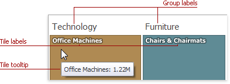

# Data Presentation Basics
The Treemap dashboard item visualizes data in nested rectangles that are called _tiles_.

## Labels and Tooltips
The Treemap displays **labels** that contain descriptions for tiles and groups, and provide **tooltips** with additional information.

