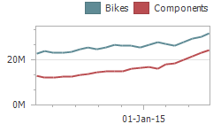
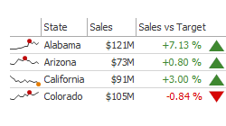
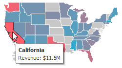

# Data Presentation Basics
The **Dashboard Viewer** is used to present dashboards in Windows Forms applications. 
A wide range of dashboard items are used to display visual or textual information.

| Dashboard Item | Image | Description |
|---|---|---|
| [Chart](../../../../dashboard-for-desktop/articles/dashboard-viewer/dashboard-items/chart.md) |  | Displays data graphically using bars, lines, points, etc. |
| [Scatter Chart](../../../../dashboard-for-desktop/articles/dashboard-viewer/dashboard-items/scatter-chart.md) |  | Visualizes relationships between numeric variables. |
| [Grid](../../../../dashboard-for-desktop/articles/dashboard-viewer/dashboard-items/grid.md) |  | Presents data in tabular form. |
| [Pies](../../../../dashboard-for-desktop/articles/dashboard-viewer/dashboard-items/pies.md) |  | Displays a series of pies or donuts that represent the contribution of each value to the total. |
| [Cards](../../../../dashboard-for-desktop/articles/dashboard-viewer/dashboard-items/cards.md) |  | Displays a series of cards, each illustrating the difference between two values. |
| [Gauges](../../../../dashboard-for-desktop/articles/dashboard-viewer/dashboard-items/gauges.md) |  | Visualizes data within a series of gauges. |
| [Pivot](../../../../dashboard-for-desktop/articles/dashboard-viewer/dashboard-items/pivot.md) |  | Displays cross-tabular reports and allows you to analyze multi-dimensional data. |
| [Choropleth Map](../../../../dashboard-for-desktop/articles/dashboard-viewer/dashboard-items/choropleth-map.md) |  | Colorizes areas in proportion to the provided values. |
| [Geo Point Map](../../../../dashboard-for-desktop/articles/dashboard-viewer/dashboard-items/geo-point-maps/data-presentation-basics.md) |  | Displays callouts on the map using geographical coordinates. |
| [Bubble Map](../../../../dashboard-for-desktop/articles/dashboard-viewer/dashboard-items/geo-point-maps/data-presentation-basics.md) |  | Displays bubbles on the map using geographical coordinates. |
| [Pie Map](../../../../dashboard-for-desktop/articles/dashboard-viewer/dashboard-items/geo-point-maps/data-presentation-basics.md) |  | Places pies on the map using geographical coordinates. |
| [Range Filter](../../../../dashboard-for-desktop/articles/dashboard-viewer/dashboard-items/range-filter.md) |  | Allows you to apply filtering by dragging selection thumbs along the argument axis. |
| [Images](../../../../dashboard-for-desktop/articles/dashboard-viewer/dashboard-items/image.md) |  | Displays images. |
| [Text Box](../../../../dashboard-for-desktop/articles/dashboard-viewer/dashboard-items/text-box.md) |  | Displays rich text within a dashboard. |
| [Treemap](../../../../dashboard-for-desktop/articles/dashboard-viewer/dashboard-items/treemap.md) |  | Visualizes data in nested rectangles. |
| [Combo Box](../../../../dashboard-for-desktop/articles/dashboard-viewer/dashboard-items/filter-elements.md) |  | Allows you to select a value(s) from the drop-down list. |
| [List Box](../../../../dashboard-for-desktop/articles/dashboard-viewer/dashboard-items/filter-elements.md) |  | Allows you to select a value(s) from the list. |
| [Tree View](../../../../dashboard-for-desktop/articles/dashboard-viewer/dashboard-items/filter-elements.md) |  | Displays values in a hierarchical way and allows you to filter other dashboard items by selecting parent/child values. |

The Dashboard Viewer enables interaction between various dashboard items. These features include **Master Filtering** and **Drill-Down**.
* [Master Filtering](../../../../dashboard-for-desktop/articles/dashboard-viewer/data-presentation/master-filtering.md)
* [Drill-Down](../../../../dashboard-for-desktop/articles/dashboard-viewer/data-presentation/drill-down.md)

To learn more about the dashboard layout, see the [Dashboard Layout](../../../../dashboard-for-desktop/articles/dashboard-viewer/data-presentation/dashboard-layout.md) topic.