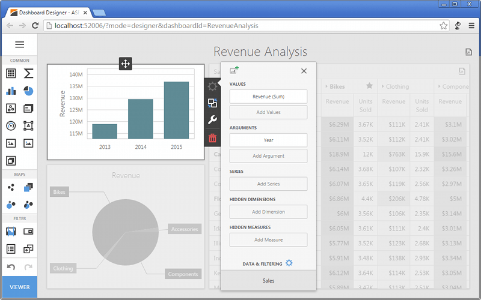

The **Web Dashboard** allows you to create dashboards in a web browser and provides an intuitive UI that facilitates data binding, shaping, layout design, etc. Many of these normally complex tasks can be accomplished with a simple drag-and-drop operation, allowing you to start creating dashboards immediately.

## Creating Dashboards
The following topics will guide you through the process of creating a dashboard.
* [Creating a Dashboard](../../dashboard-for-web/articles/web-dashboard-designer-mode/creating-a-dashboard.md)
* [Providing Data](../../dashboard-for-web/articles/web-dashboard-designer-mode/providing-data.md)
* [Adding Dashboard Items](../../dashboard-for-web/articles/web-dashboard-designer-mode/adding-dashboard-items.md)
* [Binding Dashboard Items to Data](../../dashboard-for-web/articles/web-dashboard-designer-mode/binding-dashboard-items-to-data.md)
* [Designing Dashboard Items](../../dashboard-for-web/articles/web-dashboard-designer-mode/designing-dashboard-items.md)
* [Data Shaping](../../dashboard-for-web/articles/web-dashboard-designer-mode/data-shaping.md)
* [Interactivity](../../dashboard-for-web/articles/web-dashboard-designer-mode/interactivity.md)
* [Appearance Customization](../../dashboard-for-web/articles/web-dashboard-designer-mode/appearance-customization.md)
* [Data Analysis](../../dashboard-for-web/articles/web-dashboard-designer-mode/data-analysis.md)
* [Converting Dashboard Items](../../dashboard-for-web/articles/web-dashboard-designer-mode/converting-dashboard-items.md)
* [Dashboard Layout](../../dashboard-for-web/articles/web-dashboard-designer-mode/dashboard-layout.md)
* [Undo and Redo Operations](../../dashboard-for-web/articles/web-dashboard-designer-mode/undo-and-redo-operations.md)
* [Saving a Dashboard](../../dashboard-for-web/articles/web-dashboard-designer-mode/saving-a-dashboard.md)
* [Opening a Dashboard](../../dashboard-for-web/articles/web-dashboard-designer-mode/opening-a-dashboard.md)

## Exporting
The Web Dashboard provides the capability to export the individual items of a dashboard, as well as the entire dashboard.
* [Exporting](../../dashboard-for-web/articles/web-dashboard-designer-mode/exporting.md)

## UI Elements
The topics in this section describe the main elements of the Web Dashboard.
* [UI Elements](../../dashboard-for-web/articles/web-dashboard-designer-mode/ui-elements.md)