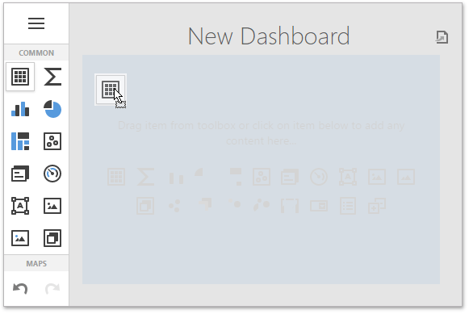
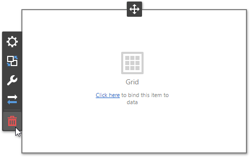

# Adding Dashboard Items
After [creating a dashboard](../../../dashboard-for-web/articles/web-dashboard-designer-mode/creating-a-dashboard.md) and [providing data](../../../dashboard-for-web/articles/web-dashboard-designer-mode/providing-data.md) to it, add **dashboard items** to display visual or textual information in a dashboard.

To create a dashboard item, click the corresponding button in the [Toolbox](../../../dashboard-for-web/articles/web-dashboard-designer-mode/ui-elements/toolbox.md) or drag an item from the Toolbox into the dashboard surface.

This creates an empty dashboard item, which you can now configure.

To completely design a dashboard item, perform the following steps.
* [Bind](../../../dashboard-for-web/articles/web-dashboard-designer-mode/binding-dashboard-items-to-data.md) the dashboard item to data.
* Set specific dashboard item settings based on its type. To learn more, see [Designing Dashboard Items](../../../dashboard-for-web/articles/web-dashboard-designer-mode/designing-dashboard-items.md).
* Perform the required [data shaping](../../../dashboard-for-web/articles/web-dashboard-designer-mode/data-shaping.md) operations (such as [grouping](../../../dashboard-for-web/articles/web-dashboard-designer-mode/data-shaping/grouping.md), [sorting](../../../dashboard-for-web/articles/web-dashboard-designer-mode/data-shaping/sorting.md), [filtering](../../../dashboard-for-web/articles/web-dashboard-designer-mode/data-shaping/filtering.md), etc.).
* Use the [interactivity](../../../dashboard-for-web/articles/web-dashboard-designer-mode/interactivity.md) features to enable interaction between various dashboard items.
* Adjust the dashboard item's position and size (a [layout](../../../dashboard-for-web/articles/web-dashboard-designer-mode/dashboard-layout.md)) and specify the dashboard item caption settings.

To remove the dashboard item from the dashboard surface, use the **Delete** button in the [dashboard item menu](../../../dashboard-for-web/articles/web-dashboard-designer-mode/ui-elements/dashboard-item-menu.md).

