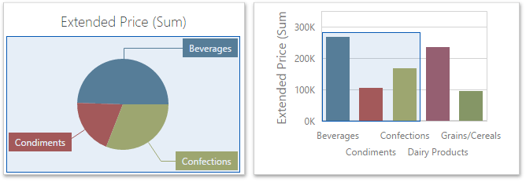
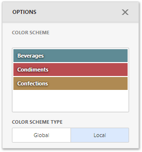
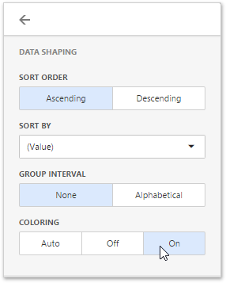
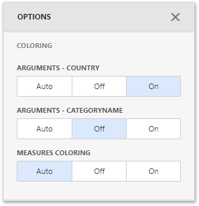
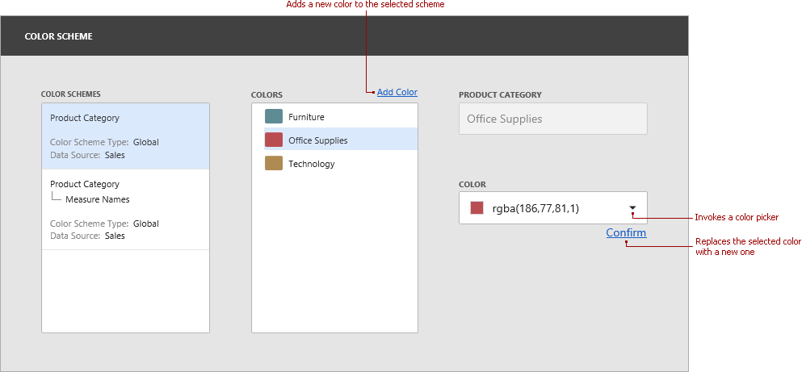
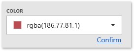
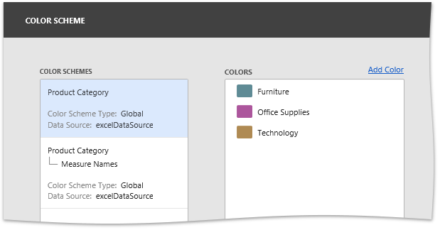
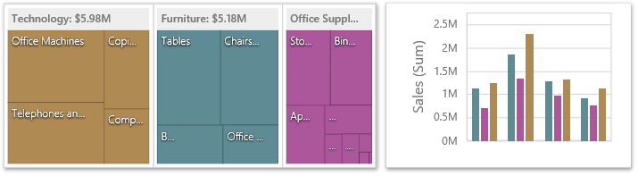
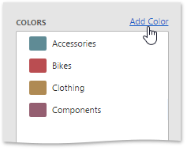
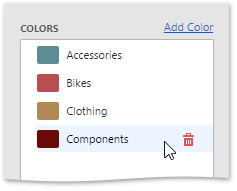

# Coloring
The Web Dashboard provides the capability to manage the coloring of dashboard item elements, such as chart series points or pie segments.
* [Supported Dashboard Items](#supporteditems)
* [Color Schemes Overview](#overview)
* [Coloring Measures and Dimensions](#coloring)
* [Customizing Color Palettes Using the Dashboard Item Menu](#customizedim)
* [Customizing Color Palettes Using the Color Scheme Page](#customizecpp)

## <a name="supporteditems"/>Supported Dashboard Items
You can manage coloring for the following dashboard items.
* [Chart](../dashboard-item-settings/chart.md)
* [Scatter Chart](../dashboard-item-settings/scatter-chart.md)
* [Pie](../dashboard-item-settings/pies.md)
* [Pie Map](../dashboard-item-settings/geo-point-maps/pie-map.md)
* [Range Filter](../dashboard-item-settings/range-filter.md)
* [Treemap](../dashboard-item-settings/treemap.md)

## <a name="overview"/>Color Schemes Overview
The dashboard provides two ways of coloring dashboard item elements.
* **Global color scheme**. This color scheme provides consistent colors for identical values across the dashboard. The image below shows the dashboard containing Pie and Chart dashboard items. Pie segments and chart series points corresponding to _Beverages_, _Condiments_ and _Confections_ dimension values are colored using identical colors from the default palette.
	
	
	
	> [!IMPORTANT]
	> When a global color scheme is used, the dashboard reserves automatically generated colors for certain values regardless of the filter state.
* **Local color scheme**. This color scheme provides an _independent_ set of colors for each dashboard item.
	
	> [!IMPORTANT]
	> When a local color scheme is used, the dashboard reassigns palette colors when the filter state is changed.

To select a type of coloring dashboard item elements, open the [dashboard item menu](../ui-elements/dashboard-item-menu.md), go to the **Color Scheme** section and use the **Color Scheme Type** option.

## <a name="coloring"/>Coloring Measures and Dimensions
Dashboard items allow you to manage the coloring of individual dimensions or all dashboard item measures using predefined coloring modes.

The following coloring settings are available.

| Setting | Description |
|---|---|
| **Auto** | Dimension values/measures are colored by default. To learn how specific dashboard items color their elements by default, see the **Coloring** topic for the corresponding [dashboard item](../dashboard-item-settings.md). |
| **On** | Dimension values/measures are colored by different hues. |
| **Off** | Dimension values/measures are colored with the same color. |

You can configure coloring in two ways.
* To specify the coloring mode for the specific measure/dimension, open the data item menu and go to **Data Shaping** section. Use the **Coloring** option to specify coloring mode of this data item.
	
	
* To see a list of all measures/dimensions for which you can specify coloring mode, open the dashboard item's [Options](../ui-elements/dashboard-item-menu.md) menu and go to the **Coloring** section.
	
	

For example, the image below shows the Chart dashboard item whose _Country_ **dimension** is colored by different hues...

...and this image shows the Pie dashboard item whose **measures** are colored by different hues.

> [!NOTE]
> If you enabled coloring by different hues for several dimensions/measures, all combinations of dimension values/measures will be automatically colored using different colors from the default palette.

## <a name="customizedim"/>Customizing Color Palettes Using the Dashboard Item Menu
The Web Dashboard allows you to customize colors of the specific palette using the **Color Scheme** section of the dashboard item [Options](../ui-elements/dashboard-item-menu.md) menu. To edit the color scheme, click the **Edit** button (the  icon) of the corresponding color.

Then, pick any color using the RGB color model in the invoked color picker and click **Confirm** to change the color.

A new color scheme will be applied to the dashboard item(s).

## <a name="customizecpp"/>Customizing Color Palettes Using the Color Schemes Page
The Color Scheme page of the [dashboard menu](../ui-elements/dashboard-menu.md) allows you to customize color tables by editing and adding colors.

* **Edit colors**. You can reassign a color in the selected color table. For this, select one of the available schemes in the **Color Schemes** pane and click the required color in the **Colors** pane to provide access to the **Color** combo box.
	
	Clicking the **Color** dropdown button invokes a color picker where you can specify a new color.
	
	
	
	Click **Confirm** to change the automatically assigned color for the selected value and update the current color scheme.
	
	
	
	The image below demonstrates the dashboard items that are colored using the updated color table.
	
	
* **Add colors**. The Color Scheme page allows you to add a new value with the specified color to the selected color scheme. To do this, use the **Add color** button.
	
	
	
	Specify the dimension value of the added color or select the required measures. This creates a new value whose color can be specified as described in the **Edit colors** section.
	
	
	
	You can remove manually added values using the **Remove** button (the  icon).