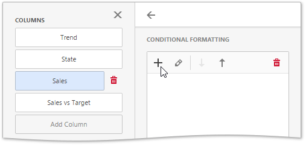
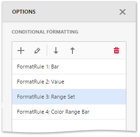
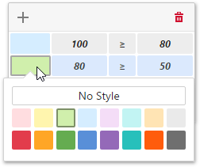

# Conditional Formatting
The Web Dashboard allows you to format dashboard item elements whose values meet a specified condition. This feature allows you to highlight specific elements using a predefined set of rules.

To learn more about the specifics of using a conditional formatting feature for different dashboard items, see the following topics.
* [Conditional Formatting - Grid](../designing-dashboard-items/grid/conditional-formatting.md)
* [Conditional Formatting - Pivot](../designing-dashboard-items/pivot/conditional-formatting.md)

Format rules used in conditional formatting can be divided into groups depending on their purpose and can be applied to measure or dimension values.

Comparison rules used in conditional formatting can be divided into the following groups.
* **Value** - Allows you to compare static values (such as Greater Than, Less Than, Between, etc.).
* **Top-Bottom** - Highlights a specific number of topmost/bottommost values.
* **Average** - Highlights values above the average value or below the average value.
* **A Date Occuring** - Allows you to highlight date-time values that fall into a specified interval.
* **Expression** - Allows you to use complex conditions to apply formatting. You can also pass dashboard parameters to expressions.
* **Icon and Color Ranges** - Allows you to apply formatting by displaying specific icons for different ranges of values. You can select a predefined set of icons or use a specific icon for each range.
* **Color Ranges** - Allows you to apply formatting using specific colors for different ranges of values. You can select a predefined set of colors or use custom appearance settings to highlight values within specified ranges.
* **Gradient Ranges** - Allows you to apply formatting using gradient color scales.
* **Bar** - Allows you to visualize numeric values using bars. You can also color bars corresponding to positive and negative values using different colors.
* **Bar Color Ranges** - Allows you to visualize numeric values using bars whose colors are contained in the specified color set.
* **Bar Gradient Ranges** - Allows you to visualize numeric values using bars whose colors are contained in the specified color gradient.

You can create comparison rules for measures or dimensions. The table below lists format conditions that can be applied to different types of data items.
* Measure/numeric Dimension
	* **Value**
	* **Top-Bottom**
	* **Average**
	* **Expression**
	* **Icon Ranges**
	* **Color Ranges**
	* **Gradient Ranges**
	* **Bar**
	* **Bar Color Ranges**
	* **Bar Gradient Ranges**
* string Dimension
	* **Value** with the condition type set to _Equal To_, _Not Equal To_ or _Text that Contains_
	* **Expression**
* date-time Dimension
	* **Value**
	* A **Date Occuring** for dimensions with the continuous date-time group interval
	* **Expression**
	* **Icon and Color Ranges**
	* **Color Ranges**
	* **Gradient Ranges**
	* **Bar**
	* **Bar Color Ranges**
	* **Bar Gradient Ranges**

## Create and Edit a Format Rule
To create a format rule, perform the following steps.
1. Select the required measure/dimension by whose values a format condition will be calculated, open the **Conditional Formating** section of the data item menu and click "+" to add a new format rule.
	
	
2. Specify the data item to which conditional formatting is applied using the **Apply to** combo box and select a condition type from the list.
	
	
3. The format rule's menu is opened. This menu depends on the selected format condition and the type of the dashboard item. Here you can specify settings specific for the selected condition. For example, the _Value_ format rule allows you to set a value that will be compared with dimension/measure values and specify a format rule style. The image below displays settings where values greater than 300M will be colored in pale green.
	
	
	
	You can specify additional settings in the **Miscellanous** section of the format rule's menu. This section contains settings depending on the type of the dashboard item. For example, you can manually specify an intersection level for the Pivot or apply the current rule to a row in the Grid.
4. The format rule is now ready and will be applied to the dashboard item. 
	
	

To edit a format rule, open the **Conditional Formatting** section of the [data item menu](../ui-elements/data-item-menu.md), select the required format rule and click the **Edit** button (the  icon). To delete the selected format rule, click the **Delete** button (the  icon).

You can see existing format rules for the entire dashboard item. To do this, open the dashboard item's [Options](../ui-elements/dashboard-item-menu.md) menu and go to the **Conditional Formatting** section.

## Appearance Settings
When creating a new format rule, you can select the required appearance settings in the **Condition** section of the format rule's menu. This settings applied according to the current format condition. All format conditions allow you to customize appearance settings in a similar manner.

For example, the _Value_ format condition allows you to specify appearance settings in the following way...
* The **Appearance** tab allows you to choose the predefined background color or font.
	
	
* The **Icons** tab allows you to add the predefined icon.
	
	

... while the different types of Range format rules allow you to customize predefined range colors and values.

