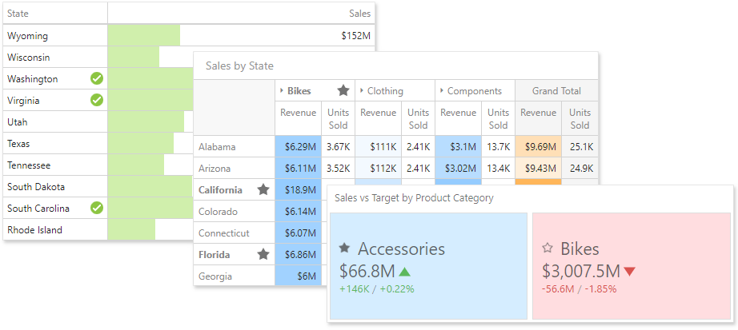
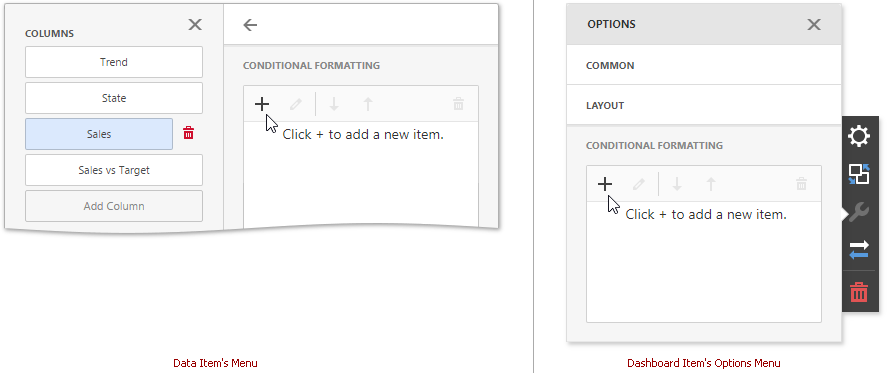
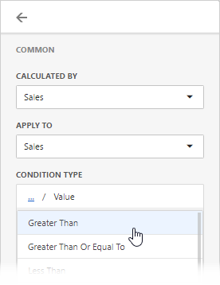
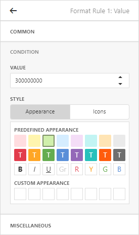
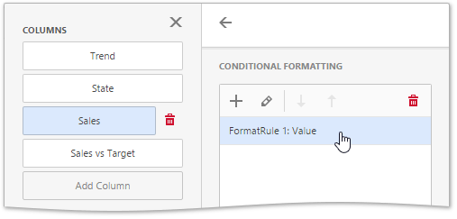
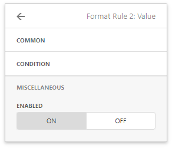
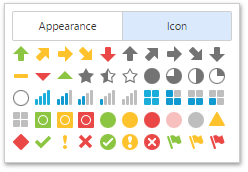
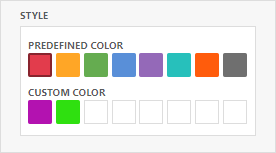
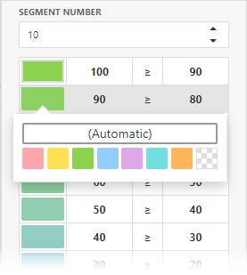

# Conditional Formatting
The Web Dashboard supports conditional formatting. You can apply a custom style to data elements that satisfy a certain condition for [Grid](../dashboard-item-settings/grid.md), [Pivot](../dashboard-item-settings/pivot.md), [Chart](../dashboard-item-settings/chart.md), [Scatter Chart](../dashboard-item-settings/scatter-chart.md) and [Card](../dashboard-item-settings/cards.md) items.

## Format Rules

Format rules used in conditional formatting can be categorized as follows:
* **Value** - Compares static values (Greater Than, Less Than, Between, etc.).
* **Top-Bottom** - Highlights a specific number of top/bottom values (Top N, Bottom N).
* **Average** - Highlights values above or below the average value.
* **A Date Occurring** - Highlights date-time values that are within a specified interval.
* **Expression** - Uses complex conditions to apply formatting. You can also pass dashboard parameters to expressions.
* **Icon and Color Ranges** - Display a specific icon based on a value range. You can select a predefined set of icons or apply a specific icon to each range.
* **Color Ranges** - Apply specific colors to different value ranges. You can select a predefined set of colors or use custom appearance settings to highlight values within specified ranges.
* **Gradient Ranges** - Apply formatting using gradient color scales.
* **Bar** - Visualizes numeric values as bars. You can also color bars corresponding to positive and negative values using different colors.
* **Bar Color Ranges** - Visualize numeric values as bars. Values within a range display a specific color.
* **Bar Gradient Ranges** - Visualize numeric values as bars. Values within a range display a specific bar gradient.

Format conditions that can be applied to different data item types are as follows:
* numeric 
	* **Value**
	* **Top-Bottom**
	* **Average**
	* **Expression** 
	* **Icon Ranges**
	* **Color Ranges**
	* **Gradient Ranges**
	* **Bar** 
	* **Bar Color Ranges** 
	* **Bar Gradient Ranges** 
* string 
	* **Value** (with the condition type set to _Equal To_, _Not Equal To_ or _Text that Contains_)
	* **Expression**
* date-time 
	* **Value**
	* A **Date Occurring** (for dimensions with a continuous date-time group interval)
	* **Expression**
	* **Icon and Color Ranges**
	* **Color Ranges**
	* **Gradient Ranges**
	* **Bar** 
	* **Bar Color Ranges** 
	* **Bar Gradient Ranges** 

## Create a Format Rule

To create a format rule, open the **Conditional Formatting** section in the dashboard item's [Options](../ui-elements/dashboard-item-menu.md) menu or in the [data item menu](../ui-elements/data-item-menu.md). Click "+" to add a new format rule:
	

Specify the data item/card used to calculate a condition in the **Common** section. You can also create a format rule for one data item and apply different settings to the other data item. 

Select a format rule type from the list to open its settings.
	

Select a condition from the list and [specify its settings](#appearance-settings) in the **Condition** section. Available settings depend on the selected format rule.
	

	
Specify additional settings in the **Miscellaneous** section. For example, you can specify the intersection level for the Pivot or apply the current rule to a row in the Grid.

## Edit a Format Rule

To edit a format rule, select the rule and click **Edit** (the  icon).

Click **Delete** (the  icon) to delete the selected format rule.

When you edit a format rule, you can enable or disable the rule in the **Miscellaneous** section.

Other settings in the **Miscellaneous** section depend on the selected dashboard item.

## Appearance Settings

The format rule menu's **Condition** section contains appearance settings. 

For Grid, Pivot, and Card items, you can configure and customize the current format condition appearance settings:

* Choose a predefined background color or font in the **Appearance** tab.
	
	

* Add a predefined icon in the **Icons** tab.

	

Chart and Scatter Chart items have a predefined palette and a custom palette. Click a color chip in the **Custom Color** palette to set a new custom color. You can pick any color using the RGB or HSB color model in the invoked color picker.

	
You can change generated colors for the Range format rules:

## Dashboard Item Format Rule Specifics

See the following sections for more information about specific format settings for dashboard items:

* [Conditional Formatting - Grid](../dashboard-item-settings/grid/conditional-formatting.md)
* [Conditional Formatting - Pivot](../dashboard-item-settings/pivot/conditional-formatting.md)
* [Conditional Formatting - Card](../dashboard-item-settings/cards/conditional-formatting.md)
* [Conditional Formatting - Chart](../dashboard-item-settings/chart/conditional-formatting.md)
* [Conditional Formatting - Scatter Chart](../dashboard-item-settings/scatter-chart/conditional-formatting.md) 
