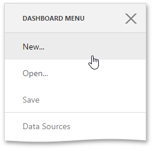

The Web dashboard allows you to embed the user interface required for creating dashboards at runtime.
 

You can create a new dashboard in two ways.
* You can open the [dashboard menu](../../../dashboard-for-web/articles/web-dashboard-designer-mode/ui-elements/dashboard-menu.md) and click the **New** button...
	
	
* ...or click **Create** in the following message if your application does not have any dashboards.
	
	

After that the **New...** page is invoked. Here you can set a dashboard name, [create a new data source](../../../dashboard-for-web/articles/web-dashboard-designer-mode/providing-data/create-a-new-data-source.md) or [connect to an existing data source](../../../dashboard-for-web/articles/web-dashboard-designer-mode/providing-data/connect-to-an-existing-data-source.md).

To learn how to provide data for the created dashboard, see [Providing Data](../../../dashboard-for-web/articles/web-dashboard-designer-mode/providing-data.md).