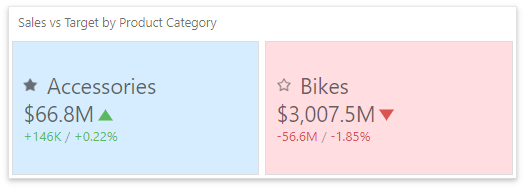
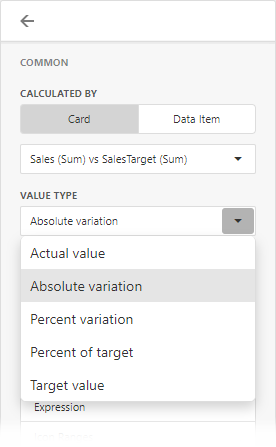
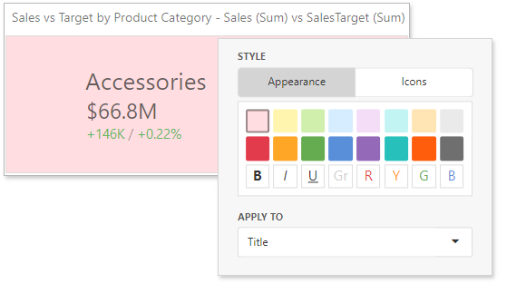

# Conditional Formatting 

For the Card dashboard item, you can apply conditional formatting to the card's visual elements (like Title, Subtitle, various values) and change the card's background.

> [!Note]
> Cards that use a [legacy layout](https://docs.devexpress.com/Dashboard/118608/create-dashboards/create-dashboards-on-the-web/dashboard-item-settings/cards/layout#legacy-layout-v162-and-earlier) do not support conditional formatting.

## Supported Format Rules

Format rules that can be applied to different data item types are as follows:
* numeric 
	* **Value**
	* **Top-Bottom**
	* **Average**
	* **Expression** 
	* **Icon Ranges**
	* **Color Ranges**
	* **Gradient Ranges**
* string 
	* **Value** (with the condition type set to _Equal To_, _Not Equal To_ or _Text that Contains_)
	* **Expression**
* date-time 
	* **Value**
	* **A Date Occurring** (for dimensions with a continuous date-time group interval)
	* **Expression**
	* **Icon and Color Ranges**
	* **Color Ranges**
	* **Gradient Ranges**

Refer to the following topic for more information about format condition types: [Conditional Formatting in Web Dashboard](../../appearance-customization/conditional-formatting.md).
## Create and Edit a Format Rule   

You can create and edit format rules in the **Conditional Formatting** section that is located in the following places:

* The dashboard item's [Options](../../ui-elements/dashboard-item-menu.md) menu

* The [data item menu](../../ui-elements/data-item-menu.md)

Refer to the following topic for information on how to create and edit format rules: [Conditional Formatting in Web Dashboard](../../appearance-customization/conditional-formatting.md).
## Card-Specific Format Condition Settings

For a Card dashboard item, you can apply conditional formatting to the card's visual elements (like Title, Subtitle, different values) and change the card's background.

Available settings in the **Common** section depend on the selected **Calculated by** option:

* The **Card** option specifies a data item container. The format rule is calculated based on the card's values. The **Value Type** option specifies the card's measurement upon which a condition is calculated.

    If the Card dashboard item contains multiple values in data item containers (cards), make sure you apply a format rule to the active card to see changes. Click  in the dashboard item caption to switch between cards. The expression format rule ignores the specified card and is applied to all cards regardless of the specified value.
* For the **Data Item** option, you can choose a hidden measure or series dimension. The rule applies to all cards in a Card item.

To apply the selected appearance to the Title, Subtitle, values, and other card layout elements, use the **Apply to** drop-down list. The _All elements_ value applies the format rule to all card elements.

If you select a background color, it applies to the entire card and the **Apply to** value is not in effect.

Some predefined background styles contain a font color. This font color applies to all the card elements regardless of the drop-down list settings (all/particular element).
